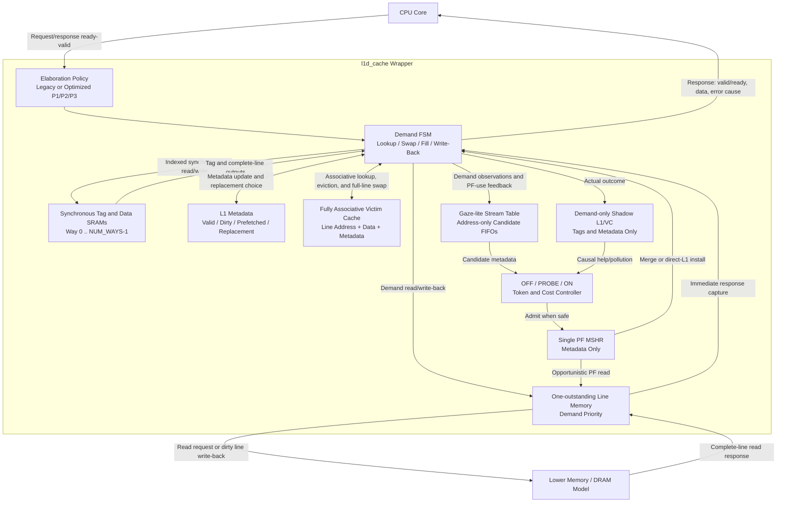

# Baseline L1 Data Cache

## Status

This document is the authoritative design and usage description for the L1
data cache. As of 2026-07-22, `l1d_cache` remains an elaboration-time research
wrapper around two write-back, write-allocate engines:

- `PREFETCH_POLICY=0` selects the frozen legacy blocking next-line engine;
- `PREFETCH_POLICY=1` selects the optimized direct-L1 research engine and is
  the research-wrapper default; and
- `PF_OPT_LEVEL=1/2/3` selects safe next-line, adaptive adjacent-stream, or
  shadow-feedback plus single-PF-MSHR behavior. Level 3 is the default.

Both engines provide:

- an RV64 load/store request contract with 64-bit byte addresses and XLEN data;
- byte, halfword, word, word-unsigned, and doubleword load semantics with
  sign or zero extension;
- byte, halfword, word, and doubleword store semantics with alignment error
  reporting;
- configurable direct-mapped or 2-way set-associative organization;
- synchronous tag and data SRAM wrappers;
- ready/valid CPU and line-memory interfaces;
- dirty eviction and line allocation FSM control;
- a parameterized fully associative victim cache;
- direct-L1 prefetching without a persistent line-sized prefetch buffer;
- legacy counters plus schema-3 candidate, issue, return, install, merge,
  discard, suppression, controller, shadow, and blocking-cost telemetry; and
- self-checking Icarus Verilog tests plus a Vivado batch entry point.

The board-facing synthesis seam is `l1d_cache_deploy`. It defaults to
`ENABLE_PREFETCH=0`, `PF_OPT_LEVEL=1`, and all optional prefetch structures
disabled by constant folding. Full P3 and P3-lite require explicit opt-in and
remain research profiles. `l1d_fpga_harness` gives Vivado a placeable scalar
I/O top instead of exposing the full line interface as device pins.

Icarus Verilog is used for fast functional checks. Vivado XSim, OOC synthesis,
independent post-route implementation, timing, and activity-based power are
the final FPGA evidence targets.

The July 22 main replay validated legacy, P1, P2, full P3, and P3-lite over the
same 25 zero-bubble windows. Full P3 saved one aggregate service cycle;
P3-lite added 31 cycles. Both kept byte overhead and prefetch-caused
write-backs at zero, but neither met the 1% improvement gate. P3-lite also
failed area, setup-timing, activity-power, and achieved-frequency execution
gates, so deployment remains prefetch-off. See the
[July 22 address-free evidence](evidence/2026-07-22-prefetch-ppa/README.md).

## Source Layout

| Path | Purpose |
| --- | --- |
| `src/l1d_sram.sv` | Single-port synchronous SRAM inference wrapper |
| `src/l1d_next_line_prefetch.sv` | Frozen one-entry legacy next-line candidate generator |
| `src/l1d_cache_legacy.sv` | Frozen legacy blocking next-line engine |
| `src/l1d_stream_prefetch.sv` | Four-entry adjacent-stream detector and two-entry metadata-only candidate FIFO |
| `src/l1d_prefetch_controller.sv` | Hysteretic OFF/PROBE/ON controller and token bucket |
| `src/l1d_shadow_cache.sv` | Demand-only tag/dirty counterfactual L1/VC model |
| `src/l1d_cache_optimized.sv` | Safe direct-L1 insertion, lifecycle telemetry, shadow feedback, and single PF MSHR |
| `src/l1d_cache.sv` | Elaboration-time legacy/optimized wrapper; optimized level 3 is default |
| `src/l1d_cache_deploy.sv` | Deployment seam; prefetch-off default and explicit structural feature parameters |
| `src/l1d_fpga_harness.sv` | Scalar-I/O FPGA harness used for independent implementation and activity power |
| `src/tb_l1d_cache.sv` | Self-checking testbench and line-memory model |
| `src/tb_l1d_cache_oop.sv` | Class-based Vivado Phase 3 workload harness |
| `src/tb_l1d_fpga_harness.sv` | Deploy-profile signature and SAIF activity testbench |
| `scripts/run_iverilog.sh` | Functional and synthetic-workload preliminary regression |
| `scripts/summarize_workloads.sh` | Convert workload log records to CSV |
| `scripts/validate_workload_results.py` | Fail-closed schema-2/schema-3 field and counter-conservation validator |
| `scripts/run_prefetch_unit_tests.sh` | Stream-detector and controller directed regression |
| `scripts/run_p3_tests.sh` | P3 shadow/MSHR, zero-bubble, TTL, EWMA, and response-lifetime regression |
| `scripts/run_vivado.tcl` | Vivado simulation, synthesis, utilization, timing, power |
| `scripts/run_remote_vivado.py` | Paramiko remote Vivado runner for the Windows host |
| `scripts/generate_phase3_traces.py` | Deterministic Phase 3 trace generator |
| `scripts/capture_spec_qemu_windows.py` | Fail-closed per-command RV64 QEMU capture and private manifests |
| `scripts/split_qemu_memtrace_windows.py` | Validate schema-v3 raw captures and emit canonical phased replay windows |
| `scripts/run_spec_trace_replay.sh` | Manifest-driven four-configuration replay and paired analysis |
| `scripts/run_feedback_replay_matrix.sh` | Serial, resumable July 22 main/sweep/sensitivity campaign matrix |
| `scripts/summarize_spec_replay.py` | Strict artifact, counter, sidecar, and off/on pair validator |
| `scripts/evaluate_prefetch_evidence.py` | Replay plus Vivado deployment-gate evaluator |
| `scripts/publish_prefetch_evidence.py` | Address-free evidence publisher and privacy audit |
| `scripts/render_spec_replay_plots.py` | Deterministic helpful/neutral/harmful classification CSV and cycle-delta SVG |
| `scripts/analyze_trace_windows.py` | Locality, stride, reuse-distance, and set-pressure analysis |
| `constraints/l1d_baseline.xdc` | Default 100 MHz synthesis clock constraint |
| `traces/smoke.trace` | Redistributable trace-replay format smoke test |
| `traces/generated/MANIFEST.md` | Generated Phase 3 trace hashes |
| `docs/phase3_vivado_report.md` | Current Vivado Phase 3 evidence and remaining gaps |

All SystemVerilog files remain under `src/` as required by the repository
layout.

## Architecture and Block Diagram

The optimized research path preserves the CPU and lower-memory protocols but
splits speculative control from demand service:

- the CPU request and response channels each have their own ready/valid
  handshake; `cpu_req_ready` belongs to the request channel and
  `cpu_rsp_valid`/`cpu_rsp_ready` belong to the response channel;
- hit/miss determination comes from tag, valid metadata, and the fully
  associative victim lookup, not from the data array;
- candidates contain addresses and attribution metadata only; returned line
  data uses the existing transient refill register and either merges with a
  waiting demand, installs directly into L1, or is discarded;
- a victim-cache entry stores the complete line address, line data, valid,
  dirty, and prefetched metadata. A victim hit swaps both data and metadata;
- dirty victim replacement is sent through the controller's write-back state,
  not directly from the victim cache to memory;
- demand SRAM access always has priority; a PF read may remain in flight while
  unrelated L1/VC hits complete;
- lower memory still permits at most one outstanding read and has no
  transaction identifier; and
- the tag-only shadow cache is updated after the actual demand outcome and is
  not on the CPU response path.

The implementation-level diagram is:



The optimized path never lets a speculative line evict dirty demand data or
cause a dirty victim-cache write-back. Prefetch installation is cold, each set
may contain at most one unused speculative line, and an unused speculative
victim is discarded instead of entering the victim cache.

## Configurable Parameters

| Parameter | Default | Constraint / meaning |
| --- | ---: | --- |
| `ADDR_WIDTH` | 64 | RV64 byte-address width |
| `DATA_WIDTH` | 64 | RV64 XLEN data width |
| `LINE_BYTES` | 16 | Power-of-two multiple of `DATA_WIDTH/8` |
| `NUM_SETS` | 8 | Power of two, at least 2 |
| `NUM_WAYS` | 2 | `1` for direct-mapped, `2` for 2-way |
| `VICTIM_ENTRIES` | 4 | Non-zero power of two; intended range is 4 to 8 |
| `ENABLE_PREFETCH` | 1 | Elaboration-time enable for built-in and external prefetch acceptance; runtime enables still apply |
| `PREFETCH_POLICY` | 1 | `0` freezes legacy behavior; `1` selects the optimized engine |
| `PF_OPT_LEVEL` | 3 | `1` safe next-line; `2` adaptive stream; `3` shadow feedback plus PF MSHR |

Those defaults describe `l1d_cache`, which is retained for research
compatibility. `l1d_cache_deploy` instead defaults `ENABLE_PREFETCH=0` and
exposes `PF_USE_STREAM`, `PF_USE_ADAPTIVE`, `PF_USE_SHADOW`, and `PF_USE_MSHR`
as independent elaboration parameters. Disabled structures are absent after
synthesis rather than merely held in reset. Its registered PF scheduler uses
an S0 capture followed by an S1 request stage, so a lower-memory request is
driven only from registered MSHR payload and remains stable through arbitrary
`mem_req_ready=0` cycles. An explicit lower-port grant gives state-owned demand
reads and write-backs priority; PF issue, token, and cost accounting advance
only when the bus payload is the registered PF request.

`VC_FORMAT_IN_SWAP=1` is the deployment choice. The OOC A/B result was 6,048
LUTs, 2,047 registers, and +0.363 ns WNS for swap-stage formatting versus
5,647 LUTs, 2,034 registers, and -0.675 ns WNS for lookup-stage formatting.
The extra logic is accepted because it is the only PF0 variant that closed the
10 ns OOC setup check.

### Transient line-register liveness

No persistent line-sized prefetch buffer was added. The existing line-width
registers cannot be safely merged without changing their state ownership:

| Register | Live interval and owner | Why it cannot alias another role |
| --- | --- | --- |
| `data_q[way]` | Synchronous SRAM read output for the currently launched set lookup | It changes with the next array read and is not storage across arbitration. |
| `working_line` | Demand hit-write or victim-swap copy through `ST_HIT_WRITE`/`ST_VC_SWAP` | A concurrent PF response would corrupt demand data before the array write or response format completes. |
| `fill_line` | The one transient lower-read response from capture through demand install, PF merge/install, or bounded discard | This is already the shared response register; a PF response is discarded if arbitration cannot consume it within two cycles. Extending its lifetime would create a prefetch buffer. |
| `evicted_data` | Replacement-line snapshot from lookup/revalidation through VC insertion or swap | Overwriting it loses the exact line that must be preserved or attributed as unused. |
| `wb_data` | Dirty victim snapshot held through a lower-memory write handshake | Aliasing would violate request-payload stability while `mem_req_ready` is low. |

These live ranges overlap on the demand/PF merge and eviction paths. Reusing a
second register would therefore trade area for data corruption or protocol
instability, not remove redundant storage. A true buffer or wider memory
transaction interface is an architecture change and was not authorized for
this closure.

Demand replacement is round-robin per set. Optimized prefetch admission uses
invalid way, then an unused-prefetched way, then (only at confidence 3) a clean
demand way when the victim cache has an invalid entry. A prefetch fill is
inserted cold and becomes the next replacement victim.

External `valid && ready` means that the aligned candidate entered the
one-entry external skid. It may later expire, be cancelled, be suppressed, or
have its response discarded. Legacy policy 0 retains the historical external
handshake semantics. `cfg_next_line_enable` controls the built-in stream
detector in optimized mode; `cfg_prefetch_enable` remains the runtime master.

## Interface Contract

### CPU request and response

A request transfers when `cpu_req_valid && cpu_req_ready` is true on a rising
clock edge. The request fields are:

- `cpu_req_addr`: byte address;
- `cpu_req_write`: `0` for load, `1` for store;
- `cpu_req_size`: `0` byte, `1` halfword, `2` word, `3` doubleword;
- `cpu_req_unsigned`: zero-extend loads smaller than XLEN when set; ignored
  for stores and doubleword loads; and
- `cpu_req_wdata`: unshifted store data in the low bytes selected by
  `cpu_req_size`.

The demand engine accepts one request at a time. Under optimized level 3, an
unrelated L1/VC hit may complete while a prefetch read is in flight; a same-line
demand miss merges into that PF MSHR. A response remains
valid in `cpu_rsp_valid` until accepted with `cpu_rsp_ready`. Loads return the
RV64 architectural result in `cpu_rsp_rdata`: `LB/LH/LW` sign-extend,
`LBU/LHU/LWU` zero-extend, and `LD` returns all 64 bits. Stores also produce
a completion response; the returned data is the post-write value selected by
the store size and should otherwise be ignored.

Alignment follows the RV64 natural-alignment rules:

| Access size | Legal address alignment |
| --- | --- |
| byte | any byte address |
| halfword | `addr[0] == 0` |
| word | `addr[1:0] == 0` |
| doubleword | `addr[2:0] == 0` |

Misaligned CPU requests are accepted and answered without touching the cache
arrays or lower memory. `cpu_rsp_error` is asserted, and
`cpu_rsp_error_cause` is `1` for a load-address-misaligned error and `2` for
a store-address-misaligned error. Hardware splitting of misaligned accesses is
not implemented.

### Lower line-memory interface

The lower interface transfers complete cache lines:

- reads use `mem_req_valid`, `mem_req_ready`, `mem_req_write=0`, and an aligned
  `mem_req_addr`;
- read data returns later as a pulse on `mem_rsp_valid` with
  `mem_rsp_rdata`; and
- write-backs use `mem_req_write=1` and `mem_req_wdata`.

The baseline assumes a write request is complete when the lower memory accepts
it. There is no separate write-response or error channel.

## FSM and Data Flow

The main states are:

1. `ST_IDLE`: select exactly one request in the order CPU (including a
   misaligned request), external prefetch, then pending built-in next-line
   prefetch.
2. `ST_LOOKUP`: consume synchronous SRAM outputs and compare all active ways
   and victim entries.
3. `ST_HIT_WRITE`: commit a byte-enabled store hit.
4. `ST_VC_SWAP`: promote a victim-cache hit into L1 and move the selected L1
   line into the same victim entry.
5. `ST_WB_REQ`: write back a dirty victim entry that must be replaced.
6. `ST_VC_INSERT`: capture an L1 eviction in the victim cache.
7. `ST_MEM_READ_REQ` / `ST_MEM_READ_WAIT`: request and wait for a line fill.
8. `ST_INSTALL`: install the filled demand or prefetched line.
9. `ST_RESP`: hold the CPU response until accepted.

The synchronous SRAM read is initiated in `ST_IDLE`; tag and data outputs are
examined in `ST_LOOKUP`. Metadata valid, dirty, and prefetched bits are
registered separately.

## Write-Back and Write-Allocate Policy

- A store hit updates the contiguous byte, halfword, word, or doubleword
  selected by `cpu_req_size` and marks the L1 line dirty.
- A store miss fetches the complete line, merges the selected store bytes,
  installs the result, and marks it dirty.
- An L1 replacement first moves the line into the victim cache.
- If the selected victim entry already contains a dirty line, that victim line
  is written to lower memory before the new eviction is inserted.
- A victim hit swaps data and metadata with the selected L1 way. A dirty victim
  hit therefore does not require an immediate lower-memory write.

This deferred write-back behavior is the central baseline mechanism for
reducing conflict-miss penalties without losing dirty data.

## Victim Cache

The victim cache is fully associative and compares aligned line addresses in
parallel. It stores valid, dirty, prefetched, address, and complete-line data
for each entry. Replacement is round-robin.

On a demand victim hit:

1. the victim line is promoted to the selected L1 way;
2. a valid L1 replacement is moved into the hit victim slot;
3. an invalid L1 way causes the victim slot to become invalid; and
4. the CPU operation is applied to the promoted line.

The testbench verifies victim rescue for both direct-mapped and 2-way
configurations, and verifies that a dirty line eventually reaches backing
memory after victim-cache replacement pressure.

## Next-Line Prefetch and Monitoring

After a demand fill, the cache queues the next aligned line. In `ST_IDLE`, the
acceptance order is CPU demand, external prefetch, then the pending built-in
next-line candidate. Any asserted CPU request reserves the cycle, including a
misaligned request that will receive an architectural error; therefore two
producers can never observe a handshake for the same slot. A line already
present in L1 or the victim cache is not fetched again.

The monitor exports:

| Counter | Meaning |
| --- | --- |
| `stat_prefetch_fills` | Prefetch lines installed in L1 |
| `stat_prefetch_useful` | Prefetched lines later consumed by a CPU request |
| `stat_prefetch_useless` | Unused prefetched lines finally overwritten in the victim cache |
| `stat_prefetch_pollution` | Prefetch allocations that displace a demand L1 line |
| `stat_prefetch_dropped` | Built-in candidates dropped because its one-entry queue was full |

`stat_prefetch_pollution` is a displacement-pressure proxy, not proof of a
performance loss: the displaced line may still be rescued by the victim cache.
The replay sidecars record every demand outcome. Exact off/on pairing compares
identical `(sequence, address, operation, size)` identities to count true L1
and lower-memory help and pollution; aggregate miss deltas alone are only net
effects.

### Adaptation interface

`cfg_prefetch_enable` is the runtime master switch.
`cfg_next_line_enable` enables only the built-in next-line candidate generator.
Disabling the built-in generator clears its pending candidate so re-enabling
does not issue an address learned in an earlier workload phase.
An external policy can submit aligned or unaligned candidate addresses using
`ext_prefetch_valid`, `ext_prefetch_ready`, and `ext_prefetch_addr`; the cache
aligns accepted candidates to a line.

One-cycle event outputs report CPU access/hit/miss, victim hit, write-back, and
prefetch fill/useful/useless/pollution/drop events. They are intended for a
future adaptive controller and verification monitor. The cumulative counters
remain available for software-visible or end-of-run statistics.

See `docs/literature_review.md` for the research rationale and limitations of
direct L1 prefetch insertion.

## Preliminary Icarus Verification

Run:

```bash
./scripts/run_iverilog.sh
```

The script compiles and runs deterministic directed tests, memory-interface
backpressure, CPU-response backpressure, handshake payload stability checks,
a 160-operation randomized golden-memory scoreboard, misaligned-demand versus
external/pending-prefetch arbitration, continuous-demand drop accounting, and
four geometry/workload configurations:

| Configuration | Covered behavior | Current Icarus result |
| --- | --- | --- |
| Direct-mapped, 8 sets, VC4, prefetch off | RV64 load/store sizes, equal 128-byte L1 capacity, misaligned errors, victim hit, dirty preservation, randomized traffic | PASS |
| 2-way, 4 sets, VC4, prefetch off | equal 128-byte L1 capacity, way replacement, backpressure, five boundary profiles, trace smoke | PASS |
| 2-way, 4 sets, VC8, prefetch off | independent victim-capacity comparison and dirty preservation | PASS |
| 2-way, 4 sets, VC4, prefetch on | next-line/victim/external behavior, arbitration regressions, fill/use/resident/drop conservation | PASS |

Generated `.vvp` files and logs are written under `sim/`. Icarus emits a known
informational message about constant selects in `always_*`; compilation and
all self-checking tests complete successfully.

Each optimized workload emits one machine-readable `WORKLOAD_RESULT schema=3`
line; an explicitly selected frozen legacy policy emits schema 2.
`scripts/summarize_workloads.sh` collects these records into the ignored
`sim/workload_results.csv`. The recorded fields include accesses, hits,
misses, victim hits, complete geometry and capacities, separate demand and
prefetch lower-memory reads, read/write bytes, true prefetch fills,
useful/useless-evicted/unused-resident conservation, drop/protocol counters,
and replay service cycles.

## Vivado Verification Evidence

### July 22 deployment closure

The final remote Vivado 2024.2.1 execution exited 0. The evidence collector
validated 15 XSim logs, eight OOC synthesis configurations, four independent
post-route implementations, SAIF-backed power reports, and 121 downloaded
log/report files. The `l1d-vivado-evidence-v3` manifest is `PASS` with no
findings. Expected `[Timing 38-282]` setup-gate warnings are evaluated from
their numerical reports; every other critical warning remains fatal to the
collector.

The controlled PF0/P3-lite comparison is:

| Stage / metric | Optimized PF0 | P3-lite | Result |
| --- | ---: | ---: | ---: |
| OOC slice LUTs | 6,048 | 10,055 | +66.25% |
| OOC registers | 2,047 | 3,095 | +51.20% |
| OOC WNS at 10 ns | +0.363 ns | -5.896 ns | P3-lite fails setup |
| Post-route slice LUTs | 751 | 2,955 | +293.48% |
| Post-route registers | 748 | 2,280 | +204.81% |
| Post-route WNS | -0.407 ns | -4.169 ns | both fail; P3-lite worse |
| Post-route WHS | +0.118 ns | +0.065 ns | both pass hold |
| Activity dynamic power | 0.008 W | 0.015 W | +87.5% |

All implementation variants have zero unconstrained paths. The combined gate
decision is `DISABLE_DEPLOY_PREFETCH_STRUCTURAL_LIMIT`: P3-lite also adds 31
cycles on the main replay, while its stream detector dominates area and
critical paths. Parameter tuning and removal of adaptive/shadow structures did
not overcome that structural cost. Full tables and provenance are in the
[July 22 evidence package](evidence/2026-07-22-prefetch-ppa/README.md).

### Optimized P3 evidence (historical July 13 result)

The final optimized remote campaign passed under Vivado 2024.2.1. It produced
11 XSim logs: eight class-based OOP workload points and three directed
auxiliary tops. The eight OOP logs contain 83 `WORKLOAD_RESULT schema=3` rows;
all report `status=PASS`, zero watchdog/protocol/duplicate-line errors, and
closed prefetch lifecycle conservation after drain. The three auxiliary logs
pass 76 stream/controller checks, 62 PF-MSHR checks, and the optimized P3 edge
scenarios. The same run synthesized four controlled configurations and
downloaded all 12 utilization/timing/power reports. The final manifest reports
`PASS`, no findings, remote exit status 0, no download failures, and a hashed
901,858-byte representative VCD. This is a simulation/flow/artifact-validation
pass, not a 100 MHz timing-closure claim.

The OOP matrix uses the sequential producer and is functional/lifecycle
evidence. True zero-bubble operation is tested across Icarus and XSim by
`tb_l1d_cache_optimized_p3` (`p3_prefetch_edges` remotely). The main P3
performance result comes from the local true-zero-bubble, 25-window trace
campaign, not from the sequential OOP result rows.

The current post-synthesis PPA is:

| Configuration | LUTs | LUT as memory | FFs | Block RAM tiles | Bonded IOB / available | WNS at 10 ns | Approx. Fmax | Vectorless power |
| --- | ---: | ---: | ---: | ---: | ---: | ---: | ---: | ---: |
| `dm_s8_vc4_pf0` | 5,679 | 57 | 2,897 | 2 | 1,447 / 106 | -1.019 ns | 90.752 MHz | 0.124 W |
| `2w_s4_vc4_pf0` | 7,137 | 372 | 3,214 | 0 | 1,447 / 106 | -2.130 ns | 82.440 MHz | 0.125 W |
| `2w_s4_vc8_pf0` | 7,891 | 372 | 4,227 | 0 | 1,447 / 106 | -2.500 ns | 80.000 MHz | 0.128 W |
| `2w_s4_vc4_pf1` | 10,882 | 372 | 4,757 | 0 | 1,510 / 106 | -9.342 ns | 51.701 MHz | 0.139 W |

Against matching `2w_s4_vc4_pf0`, enabling optimized P3 adds 3,745 LUTs
(52.473%) and 1,543 FFs (48.009%), worsens WNS by 7.212 ns, lowers the
post-synthesis Fmax estimate by 30.739 MHz, and adds 0.014 W of vectorless
power. Every configuration fails 100 MHz setup timing but passes hold. These
are post-synthesis, not implementation/post-route, values. The raw cache top
also requires 1,447 or 1,510 bonded I/Os against 106 available, so it is not a
placeable board-level top as synthesized. Vectorless power confidence is
`Low`; activity-driven power remains outstanding. Full current and historical
tables are in `docs/phase3_vivado_report.md`.

### Prior legacy evidence and reproduction

The prior legacy-engine RV64 Vivado evidence is recorded in
`docs/phase3_vivado_report.md`. A stale-report-free legacy replacement run on
2026-07-13 used
remote Vivado 2024.2.1 and the explicit geometry shared by XSim and
synthesis. It exited successfully and scanned exactly 22 log/report files:
eight simulation logs, twelve synthesis reports, the Vivado log, and the
Vivado journal. The representative waveform was validated separately. The
run produced a `PASS` evidence manifest with a 10.0 ns clock and SHA-256
values for every input and evidence artifact.

Run the local Vivado entry point on a machine with Vivado in `PATH` using:

```tcl
vivado -mode batch -source scripts/run_vivado.tcl
```

The script defaults to `xc7a35tcpg236-1`; set environment variable `L1D_PART`
to override the FPGA part. It runs the class-based OOP XSim matrix, trace
replay, low/high latency optimized prefetch cases, three directed auxiliary
tops, and synthesis for the four major hardware configurations with the 10 ns
clock constraint. Reports are
generated under `build/vivado/reports/<configuration>/`:

- `utilization.rpt`;
- `timing_summary.rpt`;
- `power.rpt`.

Simulation logs and the representative VCD are copied to
`build/vivado/reports/`. The prior legacy Phase 3 synthesis results are:

| Configuration | LUTs | FFs | Block RAM tiles | WNS at 10 ns | Approx. post-synth Fmax | Vectorless power |
| --- | ---: | ---: | ---: | ---: | ---: | ---: |
| Direct-mapped, 8 sets, VC4, prefetch off | 5,189 | 1,852 | 2 | -1.581 ns | 86.3 MHz | 0.114 W |
| 2-way, 4 sets/way, VC4, prefetch off | 5,699 | 2,246 | 0 | -2.068 ns | 82.9 MHz | 0.106 W |
| 2-way, 4 sets/way, VC8, prefetch off | 5,783 | 3,004 | 0 | -1.516 ns | 86.8 MHz | 0.106 W |
| 2-way, 4 sets/way, VC4, prefetch on | 6,222 | 2,407 | 0 | -1.626 ns | 86.0 MHz | 0.111 W |

These legacy RV64 configurations all contain 128 bytes of logical L1 data
and do not meet the 100 MHz synthesis constraint. Vivado inferred two block
RAM tiles for the direct-mapped arrays, but mapped the shallower per-way
arrays of every 2-way configuration into distributed logic and registers.
Logical capacity is controlled, but physical memory mapping is not; the
LUT/FF/timing deltas therefore cannot be attributed solely to associativity.
The Fmax column is calculated as `1000 / (10 - WNS)` and is only a
post-synthesis STA estimate. Routing and implementation can reduce it.

The power values use Vivado vectorless activity propagation, with no SAIF/VCD
activity file, default operating conditions, and `Low` confidence. They are
useful only as early relative estimates. The very high top-level I/O count
also makes these figures unsuitable as board-level power predictions.

These historical reports do not characterize optimized P3. The upgraded
11-log XSim and four-geometry synthesis/PPA run is now complete and is reported
separately above; the historical legacy numbers remain unchanged.

On Windows, use an ASCII-only project path. Vivado simulation worked under a
Chinese user profile, but the synthesis child process could not reopen the
project when its path contained non-ASCII characters.

Before final project sign-off, inspect XSim waveforms for every FSM path and
run implementation/post-route timing. For meaningful power comparison, rerun
`report_power` with representative switching activity from the workload
traces. The representative passing optimized VCD is
`build/vivado/reports/2w_s4_vc4_pf1.vcd`. The machine-readable validation
record is `build/vivado/evidence_manifest.json`.

## Workload-Driven Boundary Analysis

### Benchmark basis

SPEC CPU 2017 remains a compatibility and comparison baseline. SPEC CPU 2026,
released on May 5, 2026, is the primary current suite. The official SPEC pages
describe 43 CPU 2017 benchmarks and 52 CPU 2026 benchmarks, each organized as
integer/floating-point and speed/rate suites.

Sources:

- [SPEC CPU 2017](https://www.spec.org/cpu2017/)
- [SPEC CPU 2026](https://www.spec.org/cpu2026/)

Both suites are licensed products. SPEC CPU 2026 offers a free academic
license to eligible accredited institutions, requested by a professor or
full-time staff member. Benchmark source or proprietary input data must never
be committed to this repository.

Current local status: the capture expects the licensed SPEC CPU 2026 tree at
`/home/debian/spec2026` inside the guest. The Debian RV64 VM defaults to the
project-local `debian-rv64/` directory and can be overridden with
`L1D_QEMU_VM_DIR`. Licensed raw traces, replay windows, logs, sidecars, and
manifests stay below the ignored `build/` tree. No SPEC-derived trace is
tracked in the public repository.

### Trace-based RTL method

Running complete SPEC programs directly in an RTL testbench is impractical.
The implemented method is:

1. build and run licensed SPEC workloads on a host or architectural simulator;
2. capture only a selected timed command's U-mode memory operations, using
   physical addresses and redacting all store data;
3. select bounded warmup/measurement windows from a count pass and reproduce
   the same total event count in a fresh snapshot capture pass;
4. replay the private windows through the cache CPU interface;
5. compare the equal-capacity `dm_s8_vc4_pf0` and `2w_s4_vc4_pf0` points,
   the standalone `2w_s4_vc8_pf0` victim-capacity point, and the only strict
   prefetch pair, `2w_s4_vc4_pf0` versus `2w_s4_vc4_pf1`; and
6. publish only derived statistics and legally redistributable trace metadata.

The reusable replay driver is selected with `+TRACE=<path>`. Its line format
is:

```text
# comments begin with #
0 SIZE UNSIGNED ADDRESS
1 SIZE 0 ADDRESS DATA
```

`0` is a load and `1` is a store. `SIZE` is decimal:
`0` byte, `1` halfword, `2` word, and `3` doubleword. `UNSIGNED` is decimal
and used only by loads. Addresses and data are hexadecimal without a `0x`
prefix. Loads are checked against the testbench golden memory with the
requested sign or zero extension; stores update the golden memory after cache
completion. Blank and comment lines are ignored.
For example, after `scripts/run_iverilog.sh` builds the canonical matrix:

```bash
vvp sim/2w_s4_vc4_pf0.vvp \
  +TRACE=traces/smoke.trace \
  +TRACE_ID=smoke +CONFIG_ID=2w_s4_vc4_pf0
```

Run this command from the repository root. Relative ASCII paths avoid a known
Icarus plusarg limitation when an absolute workspace path contains non-ASCII
characters. The current extraction flow converts committed accesses into this
cache-interface format. Naturally aligned accesses retain their RV64 size. An
unaligned access contained in one 16-byte cache line becomes one byte-sized
line touch; a cross-line access becomes two byte-sized touches and uses an
independent translation for the last byte. Source-event and expanded replay-
access counts are both recorded, so no access is silently filtered. Licensed
data values are omitted.

When replaying a real-program trace, `+TRACE_SKIP_LOAD_CHECKS` retains every
load/store address but disables comparison with the synthetic golden-memory
image. The manifest-driven runner supplies this option and should be preferred
to a hand-written `vvp` command.

### Current attributable capture and replay workflow

The host plugin requires QEMU 11.0.1, Plugin API 6, `riscv64` system
emulation, and exactly one vCPU. The VM runs with `-snapshot`; the base disk
and UEFI variables are not modified. A dynamically linked timed command is
wrapped with `libl1d_roi.so`, which emits a versioned marker ABI in `a0..a5`:
magic/version, random nonce, start/stop event, command index, PID, and TID.
The plugin locks vCPU 0, U privilege, and the marker's non-Bare `satp`.
Kernel accesses and foreign U-mode address spaces are ignored and counted;
only the bound SATP contributes source events. It records physical addresses
and fails closed on malformed or mismatched markers, target IO, unsupported
sizes, missing physical addresses (including the independently translated end
of a cross-line access), incomplete windows, or count/capture disagreement.
`trace_exec` also sets and verifies `ADDR_NO_RANDOMIZE` before target `exec`;
failure to disable ASLR aborts the unit. The splitter independently checks the
context/start/stop/summary identity chain and binds every payload row to the
ROI's SATP, vCPU, and privilege.

For an ROI with at least 50,000 supported events, five non-overlapping windows
are centered at the 10th, 30th, 50th, 70th, and 90th percentiles in the source
event stream. Each source window contains 5,000 demand-only warmup events
followed by 5,000 measurement events. Its manifest separately records source
events and canonical replay accesses after any cross-line expansion. A shorter
ROI is replayed whole and is labeled `whole-roi-short`; it must not be
described as demand-warmed.

Run from the repository root:

```bash
scripts/build_qemu_memtrace_plugin.sh
python3 scripts/capture_spec_qemu_windows.py \
  --out-dir build/spec2026/qemu-private \
  --size test --label codexrv64 \
  708.sqlite_r 721.gcc_r 767.nest_r 777.zstd_r
scripts/run_spec_trace_replay.sh \
  build/spec2026/qemu-private/campaign_manifest.json \
  build/spec2026/replay/logs
```

The capture campaign and every unit manifest must be `PASS`, `valid=true`, and
hash-complete. Each count/capture snapshot also clears all outputs named by
SPEC's `compare.cmd`, runs one timed command, then requires the exact comparison
subset for the outputs that command actually generated to pass after ROI stop.
Both passes must select the same subset, and both subset files and logs are
hashed. Per-benchmark plans bind the original timed-command file, dense command
indices, and an exact disjoint partition of the full comparison plan. Campaign
provenance hashes the executing QEMU binary, immutable VM/firmware inputs,
target ELF, plugin, and every host capture source; a temporary complete graph
must validate before PASS publication. The replay runner consumes only those
manifests, rejects stale or extra traces, compiles four explicit geometries,
records binary/simulator/command/cwd hashes and identity, and invokes
`summarize_spec_replay.py`. Its defaults are optimized P3, true zero-bubble,
and schema 3. Schema-3 sidecars record demand present/accept/response plus
prefetch candidate/admit/issue/return/install/use/evict/cancel/discard/merge,
controller, suppression, and write-back-attribution events. The analyzer also
accepts retained schema-2 legacy evidence and validates the appropriate
lifecycle conservation rules for each schema.

The direct-mapped and VC8 configurations are standalone comparison points,
not prefetch pairs. Validated pairs produce `classification.csv` and
`cycles-on-minus-off.svg`; the sign of `cycles_on_minus_off` alone defines
helpful (negative), neutral (zero), or harmful (positive). Aggregate lifecycle
and demand latency are measured, but PF event rows do not yet carry a shared
transaction ID, so per-prefetch candidate-to-issue-to-return latency remains a
separate future measurement.

The current optimized main and sensitivity results are authoritative for the
new default and are recorded in
[the optimized evidence package](evidence/2026-07-13-optimized/README.md). To
reproduce the frozen sequential legacy result below, use explicit overrides:

```bash
L1D_PREFETCH_POLICY=0 L1D_PF_OPT_LEVEL=0 \
L1D_PRODUCER_PROFILE=sequential L1D_SIDECAR_SCHEMA=2 \
scripts/run_spec_trace_replay.sh \
  build/spec2026/qemu-private/campaign_manifest.json \
  build/spec2026/replay-legacy/logs
```

#### Frozen legacy July 13, 2026 baseline

The private campaign passed for `708.sqlite_r`, `721.gcc_r`, `767.nest_r`, and
`777.zstd_r`. Five command units produced 25 sampled windows with matching
count/capture totals, valid process identity, physical addresses, and zero
violations.

The five ROIs contained 11,726,347,548 source events. Cross-line expansion
added 11,104,621 accesses, giving 11,737,452,169 canonical accesses. The
250,000 sampled source rows became 250,971 replay payload records.

Manifest-driven replay completed 100 runs: four configurations for each of 25
windows. This yielded 25 exact `2w_s4_vc4_pf0`/`2w_s4_vc4_pf1` pairs and 50
standalone direct-mapped or VC8 runs. Analyzer validation reported `PASS`.

| Pairs | Accuracy | L1 coverage | Lower coverage | Bandwidth overhead | Bytes on-off | Service cycles on-off | Harmful / neutral / helpful |
| ---: | ---: | ---: | ---: | ---: | ---: | ---: | --- |
| 25 | 0.215690268 | 0.049647522 | 0.067245888 | 0.537997464 | 672,032 | 328,996 | 25 / 0 / 0 |

Paired sidecars found 8,079 true L1 helps versus 4,776 true L1 pollution
events, and 9,018 lower-memory helps versus 5,032 lower-memory pollution
events. Prefetch reads and fills both totaled 44,193; 9,532 were useful.

Every pair increased serialized replay service cycles. This classification is
specific to the sampled windows, fixed blocking memory model, and current
next-line policy; it is not a whole-program CPU performance result.

Public, address-free artifacts are the [aggregate CSV](evidence/2026-07-13/aggregate.csv),
[pair CSV](evidence/2026-07-13/pairs.csv),
[classification CSV](evidence/2026-07-13/classification.csv), and
[cycle-delta SVG](evidence/2026-07-13/cycles-on-minus-off.svg).
Their hashes, private exclusions, and final Vivado evidence anchor are recorded
in the [public provenance index](evidence/2026-07-13/provenance.json).

The private capture and replay campaign SHA-256 values are respectively
`057965ff31234bac274ce81fc719780dbd2e7d60a59ccceb359b3b7ac64a7f9f`
and `e593bd279361036e4cb75c4cf9d1b959afb2071fb0d7c4ca1e425323a8f9cc78`.
Historical mixed-system SPEC traces remain non-authoritative.

### Historical `782.lbm_r` capture (non-authoritative)

The remainder of this subsection records an earlier local experiment only.
Its trace files are no longer tracked, its old plugin options and marker ABI
have been replaced, and its aggregate result must not be used as current SPEC
or prefetch evidence.

The RV64 Debian VM is started from the VM directory:

```bash
export RV64_VM_DIR=/path/to/debian-rv64
cd "$RV64_VM_DIR"
./start.sh
./ssh.sh
```

The historical host-side QEMU memory-trace plugin was built from the
repository root:

```bash
scripts/build_qemu_memtrace_plugin.sh
```

That retired plugin wrote the trace-replay text format directly and supported
`out=...`, `limit=...`, `start=on|off`, `phys=on|off`, `noio=on|off`, and
`aligned=on|off`. For benchmark isolation, the VM is launched with
`start=off`, and an instrumented `lbm_r_trace` binary uses two RISC-V HINT
markers to start and stop tracing around the LBM timestep loop:

`aligned=on` is the plugin default and omits misaligned architectural accesses
during capture. Use `aligned=off` when collecting a raw architectural trace and
then post-process that file into a replay-ready aligned trace if the RTL model
does not split misaligned accesses.

```c
__asm__ __volatile__(".word 0x12300013" ::: "memory"); /* start */
__asm__ __volatile__(".word 0x12400013" ::: "memory"); /* stop */
```

The benchmark subset is copied into the VM instead of copying the full SPEC
tree:

```bash
export SPEC_DIR=/path/to/spec2026
export RV64_VM_DIR=/path/to/debian-rv64
rsync -a --delete \
  -e "ssh -p 2222 -o BatchMode=yes \
      -o UserKnownHostsFile=$RV64_VM_DIR/ssh_known_hosts" \
  "$SPEC_DIR/benchspec/CPU/782.lbm_r/" \
  debian@127.0.0.1:/home/debian/spec2026-782-lbm_r/
```

Inside the VM, the benchmark is built and the SPEC test input is verified:

```bash
export BENCH_DIR=/home/debian/spec2026-782-lbm_r
cd "$BENCH_DIR/src"
gcc -std=c18 -DSPEC -DNDEBUG -DSPEC_AUTO_SUPPRESS_THREADING \
  -DSPEC_RATE -g -O3 lbm.c main.c -lm -o lbm_r

mkdir -p "$BENCH_DIR/run/test"
cd "$BENCH_DIR/run/test"
cp ../../data/test/input/lbm.in .
cp ../../data/all/input/200_200_130_ldc.of .
../../src/lbm_r $(cat lbm.in) > lbm.out 2> lbm.err
diff -u ../../data/test/output/lbm.out lbm.out
```

The validated run used `lbm.in` arguments:

```text
10 reference.dat 0 0 200_200_130_ldc.of
```

Validation passed on Debian GNU/Linux 13 riscv64 with GCC 14.2.0. The run
used about 1.6 GiB maximum resident memory. The instrumented `lbm_r_trace`
binary produced identical output before plugin-based capture.

The historical local artifacts were the following; none is tracked now:

| File | Purpose |
| --- | --- |
| `traces/spec2026_782_lbm_r_test_1m.trace` | Raw first 1,000,000 traced data accesses from the instrumented timestep region |
| `traces/spec2026_782_lbm_r_test_1m.trace.zst` | Compressed copy of the raw trace |
| `traces/spec2026_782_lbm_r_test_1m_aligned.trace` | Replay-ready version with 8 misaligned architectural accesses removed |
| `traces/spec2026_782_lbm_r_test_1m_aligned.trace.zst` | Compressed copy of the aligned trace |

The raw trace contains 1,000,000 accesses: 554,082 loads and 445,918 stores.
Because the cache model returns RV64 misaligned-address errors rather than
splitting misaligned operations, the replay input is the aligned trace with
999,992 accesses: 554,078 loads and 445,914 stores.

The aligned trace was replayed through the 2-way, 4-entry victim-cache
configuration with load-data checks disabled:

```bash
iverilog -g2012 -Wall \
  -s tb_l1d_cache \
  -P tb_l1d_cache.NUM_WAYS=2 \
  -P tb_l1d_cache.NUM_SETS=4 \
  -P tb_l1d_cache.LINE_BYTES=16 \
  -P tb_l1d_cache.ENABLE_PREFETCH=0 \
  -P tb_l1d_cache.VICTIM_ENTRIES=4 \
  -o sim/two_way_vc4_trace.vvp \
  src/l1d_sram.sv src/l1d_next_line_prefetch.sv \
  src/l1d_cache.sv src/tb_l1d_cache.sv

vvp sim/two_way_vc4_trace.vvp \
  +TRACE=traces/spec2026_782_lbm_r_test_1m_aligned.trace \
  +TRACE_SKIP_LOAD_CHECKS \
  +TRACE_ID=historical_782_lbm_r +CONFIG_ID=2w_s4_vc4_pf0
```

The original run passed and produced the following legacy schema-1 record;
the frozen legacy policy emits a wider schema-2 record, while the optimized
default emits schema 3:

```text
WORKLOAD_RESULT name=trace_replay ways=2 vc=4 prefetch=0 accesses=999992 hits=327155 misses=672837 victim_hits=23347 mem_reads=649490 mem_writes=380607 useful=0 useless=0 pollution=0 dropped=0 cycles=9175526
```

### Workload classes

The boundary study must include:

- sequential streaming and dense-array regions, expected to favor next-line
  prefetching;
- fixed-stride regions, swept from one word to multiple cache capacities;
- pointer-chasing and graph-like regions, expected to provide low next-line
  accuracy;
- conflict-focused regions mapping multiple active lines to one set, expected
  to demonstrate victim-cache benefit; and
- mixed load/store regions with dirty working sets, stressing deferred
  write-back bandwidth.

### Executable synthetic boundary tests

The preliminary testbench implements five deterministic profiles before
licensed SPEC traces are available:

- `sequential_stream`: one access per consecutive line;
- `stride_two_lines`: every other line, so a next-line prefetch is not used;
- `localized_two_line_loop`: repeated temporal reuse of two adjacent lines;
- `same_set_conflict_thrash`: `NUM_WAYS+1` lines mapping to one set; and
- `irregular_pointer_chase`: a fixed non-adjacent permutation of line
  addresses.

The tests assert counter conservation (`hits + misses = accesses`), expected
next-line usefulness or non-usefulness, stable localized hits, and victim
retention of the complete conflict working set. They are synthetic
microbenchmarks, not substitutes for SPEC traces.

The frozen legacy schema-2 results for the strict 2-way, four-set, VC4 off/on
pair on July 13, 2026 are:

| Profile | Prefetch | Hits | Misses | Victim hits | Demand reads | Prefetch reads | Fills | Useful | Useless evicted | Unused resident | Pollution proxy | Service cycles |
| --- | ---: | ---: | ---: | ---: | ---: | ---: | ---: | ---: | ---: | ---: | ---: | ---: |
| Sequential stream | Off | 0 | 12 | 0 | 12 | 0 | 0 | 0 | 0 | 0 | 0 | 127 |
| Sequential stream | On | 6 | 6 | 0 | 6 | 6 | 6 | 6 | 0 | 0 | 2 | 128 |
| Two-line stride | Off | 0 | 12 | 0 | 12 | 0 | 0 | 0 | 0 | 0 | 0 | 132 |
| Two-line stride | On | 0 | 12 | 0 | 12 | 12 | 12 | 0 | 6 | 6 | 0 | 226 |
| Localized loop | Off | 10 | 2 | 0 | 2 | 0 | 0 | 0 | 0 | 0 | 0 | 62 |
| Localized loop | On | 11 | 1 | 0 | 1 | 1 | 1 | 1 | 0 | 0 | 0 | 62 |
| Same-set conflict | Off | 0 | 12 | 9 | 3 | 0 | 0 | 0 | 0 | 0 | 0 | 78 |
| Irregular pointer chase | Off | 0 | 12 | 0 | 12 | 0 | 0 | 0 | 0 | 0 | 0 | 132 |
| Irregular pointer chase | On | 0 | 12 | 0 | 12 | 12 | 12 | 0 | 6 | 6 | 0 | 226 |

`fills = useful + useless_evicted + unused_resident`, so accuracy uses actual
fills rather than reconstructing a denominator from evictions. The RTL
`pollution_proxy` is displacement pressure only; true baseline-hit/prefetch-
miss pollution is computed from the strict off/on per-demand replay sidecars.

These results demonstrate the intended boundary rather than a general
performance claim. With this blocking implementation, next-line prefetching
converts half of the sequential demand accesses into hits but does not reduce
the total lower-memory reads. For the non-adjacent stride and pointer profiles,
it doubles lower-memory reads and increases cycles without removing a demand
miss. The victim cache retains the three-line, single-set working set for the
2-way configuration, so only the first three accesses reach lower memory.

For each frozen legacy trace region, `WORKLOAD_RESULT schema=2` records `sets`, `ways`,
`line_bytes`, `l1_bytes`, `victim_entries`, `victim_bytes`, `total_bytes`,
`prefetch`, `accesses`, `hits`, `misses`, `victim_hits`,
`demand_mem_reads`, and `prefetch_mem_reads`.

Its remaining traffic fields are `mem_reads`, `mem_writes`, `read_bytes`,
`write_bytes`, `writebacks`, and `replay_service_cycles`. Prefetch lifecycle
fields are `fills`, `useful`, `useless_evicted`, and `unused_resident`.

The schema also exposes `pollution_proxy`, `dropped`, `timely_useful`,
`late_useful`, `watchdogs`, `protocol`, and `duplicate_lines`. Paired analysis
adds coverage, bandwidth, classification, true help/pollution, and locality.

Schema 2 has no `stall_cycles` or `amat` field. `replay_service_cycles`
describes the serialized cache model and is not whole-program CPU execution
time. Architectural stall-cycle and measured-AMAT outputs remain future work.

The current boundary plots can sweep associativity, victim entries 4/8,
prefetch enable, cache capacity, line size, and lower-memory latency. The
present RTL requires at least one victim entry; adding zero-entry bypass before
a future 0/4/8 sweep remains future work.

## Current Limitations and Next Steps

- One CPU request can be outstanding. Optimized P3 has one metadata-only PF
  MSHR and hit-under-prefetch, but no general demand MSHR or demand
  hit-under-miss.
- The lower memory interface has no error response and no write acknowledgment.
- Replacement is round-robin rather than true LRU.
- Prefetching is best-effort and can starve under continuous demand traffic.
- Counter overflow is modulo 32 bits.
- Misaligned CPU requests return load/store-address-misaligned errors; the
  cache does not split one architectural access into multiple aligned cache
  accesses.
- Coherence, atomics, explicit fence/flush/invalidate commands, ECC, MMU/TLB
  translation, PMP/PMA checks, and uncached MMIO regions are outside this L1D
  baseline and must be handled by surrounding system logic or future RTL.
- XSim, OOC synthesis, independent implementation/post-route timing, and
  activity-based power evidence are complete. The result does not close the
  deployment gate; prefetch remains off by default.
- Manual all-path waveform review remains outstanding.
