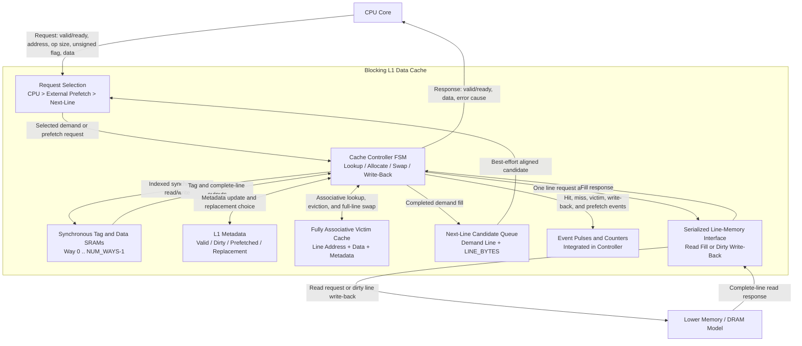

# Baseline L1 Data Cache

## Status

This document is the authoritative design and usage description for the
baseline L1 data cache. The current RTL implements a blocking, write-back,
write-allocate cache with:

- an RV64 load/store request contract with 64-bit byte addresses and XLEN data;
- byte, halfword, word, word-unsigned, and doubleword load semantics with
  sign or zero extension;
- byte, halfword, word, and doubleword store semantics with alignment error
  reporting;
- configurable direct-mapped or 2-way set-associative organization;
- synchronous tag and data SRAM wrappers;
- ready/valid CPU and line-memory interfaces;
- dirty eviction and line allocation FSM control;
- a parameterized fully associative victim cache;
- next-line prefetching with basic usefulness and pollution counters; and
- self-checking Icarus Verilog tests plus a Vivado batch entry point.

Icarus Verilog is used only for fast preliminary functional checks. Vivado
simulation and synthesis are the final project verification targets.

## Source Layout

| Path | Purpose |
| --- | --- |
| `src/l1d_sram.sv` | Single-port synchronous SRAM inference wrapper |
| `src/l1d_next_line_prefetch.sv` | Replaceable one-entry next-line candidate generator |
| `src/l1d_cache.sv` | Cache datapath, FSM, victim cache, prefetcher, counters |
| `src/tb_l1d_cache.sv` | Self-checking testbench and line-memory model |
| `src/tb_l1d_cache_oop.sv` | Class-based Vivado Phase 3 workload harness |
| `scripts/run_iverilog.sh` | Functional and synthetic-workload preliminary regression |
| `scripts/summarize_workloads.sh` | Convert workload log records to CSV |
| `scripts/run_vivado.tcl` | Vivado simulation, synthesis, utilization, timing, power |
| `scripts/run_remote_vivado.py` | Paramiko remote Vivado runner for the Windows host |
| `scripts/generate_phase3_traces.py` | Deterministic Phase 3 trace generator |
| `constraints/l1d_baseline.xdc` | Default 100 MHz synthesis clock constraint |
| `traces/smoke.trace` | Redistributable trace-replay format smoke test |
| `traces/generated/MANIFEST.md` | Generated Phase 3 trace hashes |
| `docs/phase3_vivado_report.md` | Current Vivado Phase 3 evidence and remaining gaps |

All SystemVerilog files remain under `src/` as required by the repository
layout.

## Architecture and Block-Diagram


The following corrections are required for it to represent the current RTL:

- the CPU request and response channels each have their own ready/valid
  handshake; `cpu_req_ready` belongs to the request channel and
  `cpu_rsp_valid`/`cpu_rsp_ready` belong to the response channel;
- hit/miss determination comes from tag, valid metadata, and the fully
  associative victim lookup, not from the data array;
- the next-line address is `line_address + LINE_BYTES`, not byte address
  `+1`; the prefetcher produces a candidate and does not access memory
  directly;
- a victim-cache entry stores the complete line address, line data, valid,
  dirty, and prefetched metadata. A victim hit swaps both data and metadata;
- dirty victim replacement is sent through the controller's write-back state,
  not directly from the victim cache to memory;
- event counters are currently integrated in `l1d_cache`, rather than a
  separate hardware-monitor module; and
- the current blocking design has one serialized lower-memory request path.
  The apparent bus arbiter is therefore FSM request selection, not a separate
  multi-master interconnect.

The implementation-level diagram is:



`SELECT`, `META`, `MON`, and `MEMIF` are conceptual boundaries inside
`l1d_cache.sv`; only the SRAM wrapper and next-line generator are separate RTL
module instances in the present baseline.

## Configurable Parameters

| Parameter | Default | Constraint / meaning |
| --- | ---: | --- |
| `ADDR_WIDTH` | 64 | RV64 byte-address width |
| `DATA_WIDTH` | 64 | RV64 XLEN data width |
| `LINE_BYTES` | 16 | Power-of-two cache-line size |
| `NUM_SETS` | 8 | Power of two, at least 2 |
| `NUM_WAYS` | 2 | `1` for direct-mapped, `2` for 2-way |
| `VICTIM_ENTRIES` | 4 | Non-zero power of two; intended range is 4 to 8 |
| `ENABLE_PREFETCH` | 1 | Enables idle-cycle next-line prefetch requests |

The current replacement policy is round-robin per set. With two ways this is
equivalent to selecting the way after the most recently selected way. Invalid
ways are always preferred.

## Interface Contract

### CPU request and response

A request transfers when `cpu_req_valid && cpu_req_ready` is true on a rising
clock edge. The request fields are:

- `cpu_req_addr`: byte address;
- `cpu_req_write`: `0` for load, `1` for store;
- `cpu_req_size`: `0` byte, `1` halfword, `2` word, `3` doubleword;
- `cpu_req_unsigned`: zero-extend loads smaller than XLEN when set; ignored
  for stores and doubleword loads; and
- `cpu_req_wdata`: unshifted store data in the low bytes selected by
  `cpu_req_size`.

The cache is blocking and accepts one request at a time. A response remains
valid in `cpu_rsp_valid` until accepted with `cpu_rsp_ready`. Loads return the
RV64 architectural result in `cpu_rsp_rdata`: `LB/LH/LW` sign-extend,
`LBU/LHU/LWU` zero-extend, and `LD` returns all 64 bits. Stores also produce
a completion response; the returned data is the post-write value selected by
the store size and should otherwise be ignored.

Alignment follows the RV64 natural-alignment rules:

| Access size | Legal address alignment |
| --- | --- |
| byte | any byte address |
| halfword | `addr[0] == 0` |
| word | `addr[1:0] == 0` |
| doubleword | `addr[2:0] == 0` |

Misaligned CPU requests are accepted and answered without touching the cache
arrays or lower memory. `cpu_rsp_error` is asserted, and
`cpu_rsp_error_cause` is `1` for a load-address-misaligned error and `2` for
a store-address-misaligned error. Hardware splitting of misaligned accesses is
not implemented.

### Lower line-memory interface

The lower interface transfers complete cache lines:

- reads use `mem_req_valid`, `mem_req_ready`, `mem_req_write=0`, and an aligned
  `mem_req_addr`;
- read data returns later as a pulse on `mem_rsp_valid` with
  `mem_rsp_rdata`; and
- write-backs use `mem_req_write=1` and `mem_req_wdata`.

The baseline assumes a write request is complete when the lower memory accepts
it. There is no separate write-response or error channel.

## FSM and Data Flow

The main states are:

1. `ST_IDLE`: accept a CPU request, or launch a pending prefetch when the CPU
   has no request.
2. `ST_LOOKUP`: consume synchronous SRAM outputs and compare all active ways
   and victim entries.
3. `ST_HIT_WRITE`: commit a byte-enabled store hit.
4. `ST_VC_SWAP`: promote a victim-cache hit into L1 and move the selected L1
   line into the same victim entry.
5. `ST_WB_REQ`: write back a dirty victim entry that must be replaced.
6. `ST_VC_INSERT`: capture an L1 eviction in the victim cache.
7. `ST_MEM_READ_REQ` / `ST_MEM_READ_WAIT`: request and wait for a line fill.
8. `ST_INSTALL`: install the filled demand or prefetched line.
9. `ST_RESP`: hold the CPU response until accepted.

The synchronous SRAM read is initiated in `ST_IDLE`; tag and data outputs are
examined in `ST_LOOKUP`. Metadata valid, dirty, and prefetched bits are
registered separately.

## Write-Back and Write-Allocate Policy

- A store hit updates the contiguous byte, halfword, word, or doubleword
  selected by `cpu_req_size` and marks the L1 line dirty.
- A store miss fetches the complete line, merges the selected store bytes,
  installs the result, and marks it dirty.
- An L1 replacement first moves the line into the victim cache.
- If the selected victim entry already contains a dirty line, that victim line
  is written to lower memory before the new eviction is inserted.
- A victim hit swaps data and metadata with the selected L1 way. A dirty victim
  hit therefore does not require an immediate lower-memory write.

This deferred write-back behavior is the central baseline mechanism for
reducing conflict-miss penalties without losing dirty data.

## Victim Cache

The victim cache is fully associative and compares aligned line addresses in
parallel. It stores valid, dirty, prefetched, address, and complete-line data
for each entry. Replacement is round-robin.

On a demand victim hit:

1. the victim line is promoted to the selected L1 way;
2. a valid L1 replacement is moved into the hit victim slot;
3. an invalid L1 way causes the victim slot to become invalid; and
4. the CPU operation is applied to the promoted line.

The testbench verifies victim rescue for both direct-mapped and 2-way
configurations, and verifies that a dirty line eventually reaches backing
memory after victim-cache replacement pressure.

## Next-Line Prefetch and Monitoring

After a demand fill, the cache queues the next aligned line. The prefetch runs
only when `ST_IDLE` sees no CPU request, so demand traffic has priority. A line
already present in L1 or the victim cache is not fetched again.

The monitor exports:

| Counter | Meaning |
| --- | --- |
| `stat_prefetch_fills` | Prefetch lines installed in L1 |
| `stat_prefetch_useful` | Prefetched lines later consumed by a CPU request |
| `stat_prefetch_useless` | Unused prefetched lines finally overwritten in the victim cache |
| `stat_prefetch_pollution` | Prefetch allocations that displace a demand L1 line |
| `stat_prefetch_dropped` | Built-in candidates dropped because its one-entry queue was full |

`stat_prefetch_pollution` is a hardware proxy for pressure, not proof of a
performance loss: the displaced line may still be rescued by the victim cache.
Final workload analysis must correlate it with miss count, memory traffic, and
AMAT.

### Adaptation interface

`cfg_prefetch_enable` is the runtime master switch.
`cfg_next_line_enable` enables only the built-in next-line candidate generator.
Disabling the built-in generator clears its pending candidate so re-enabling
does not issue an address learned in an earlier workload phase.
An external policy can submit aligned or unaligned candidate addresses using
`ext_prefetch_valid`, `ext_prefetch_ready`, and `ext_prefetch_addr`; the cache
aligns accepted candidates to a line.

One-cycle event outputs report CPU access/hit/miss, victim hit, write-back, and
prefetch fill/useful/useless/pollution/drop events. They are intended for a
future adaptive controller and verification monitor. The cumulative counters
remain available for software-visible or end-of-run statistics.

See `docs/literature_review.md` for the research rationale and limitations of
direct L1 prefetch insertion.

## Preliminary Icarus Verification

Run:

```bash
./scripts/run_iverilog.sh
```

The script compiles and runs deterministic directed tests, memory-interface
backpressure, CPU-response backpressure, handshake payload stability checks,
a 160-operation randomized golden-memory scoreboard, and three
synthetic-workload configurations:

| Configuration | Covered behavior | Current Icarus result |
| --- | --- | --- |
| Direct-mapped, VC4, prefetch off | RV64 load/store sizes, sign/zero extension, misaligned errors, 64-bit high-address tags, victim hit, dirty preservation, randomized traffic | PASS |
| 2-way, VC4, prefetch off | same checks with way replacement and backpressure | PASS |
| 2-way, VC8, prefetch off | same RV64 checks with 8-entry victim replacement and dirty preservation | PASS |
| 2-way, VC4, prefetch on | next-line fill, victim rescue of prefetched data, external injection, usefulness accounting | PASS |
| Direct-mapped, VC4, prefetch off | five synthetic boundary profiles | PASS |
| 2-way, VC4, prefetch off | five synthetic boundary profiles | PASS |
| 2-way, VC4, prefetch on | five synthetic boundary profiles and prefetch boundary assertions | PASS |
| 2-way, VC4, prefetch off | RV64 text trace replay, load signedness, store sizes, golden-memory checking | PASS |

Generated `.vvp` files and logs are written under `sim/`. Icarus emits a known
informational message about constant selects in `always_*`; compilation and
all self-checking tests complete successfully.

Each workload emits one machine-readable `WORKLOAD_RESULT` line.
`scripts/summarize_workloads.sh` collects these records into the ignored
`sim/workload_results.csv`. The recorded fields include accesses, hits,
misses, victim hits, accepted lower-memory reads and writes, prefetch events,
and elapsed testbench cycles.

## Vivado Verification

The current RV64 Vivado evidence is recorded in
`docs/phase3_vivado_report.md`. The final Phase 3 run on 2026-07-01 used
remote Vivado 2024.2.1, staged the project under
`C:/Users/kevin/l1d_codex_ascii_20260701_r10`, and passed log scanning after
downloading the reports.

Run the local Vivado entry point on a machine with Vivado in `PATH` using:

```tcl
vivado -mode batch -source scripts/run_vivado.tcl
```

The script defaults to `xc7a35tcpg236-1`; set environment variable `L1D_PART`
to override the FPGA part. It runs the class-based OOP XSim matrix, trace
replay, low/high latency next-line prefetch cases, and synthesis for the four
major hardware configurations with the 10 ns clock constraint. Reports are
generated under `build/vivado/reports/<configuration>/`:

- `utilization.rpt`;
- `timing_summary.rpt`;
- `power.rpt`.

Simulation logs and the representative VCD are copied to
`build/vivado/reports/`. The current Phase 3 synthesis results are:

| Configuration | LUTs | FFs | RAMB36 | WNS at 10 ns | Approx. post-synth Fmax | Vectorless power |
| --- | ---: | ---: | ---: | ---: | ---: | ---: |
| Direct-mapped, VC4, prefetch off | 5,178 | 1,853 | 2 | -1.291 ns | 88.6 MHz | 0.117 W |
| 2-way, VC4, prefetch off | 4,721 | 2,008 | 4 | -0.417 ns | 96.0 MHz | 0.107 W |
| 2-way, VC8, prefetch off | 5,395 | 2,767 | 4 | -1.462 ns | 87.2 MHz | 0.117 W |
| 2-way, VC4, prefetch on | 5,789 | 2,168 | 4 | -1.981 ns | 83.5 MHz | 0.117 W |

These current RV64 configurations do not meet the 100 MHz synthesis
constraint. The data arrays were inferred as block RAM; tag arrays were
inferred as distributed RAM. The Fmax column is calculated as
`1000 / (10 - WNS)` and is only a post-synthesis STA estimate. Routing and
implementation can reduce it.

The power values use Vivado vectorless activity propagation, with no SAIF/VCD
activity file, default operating conditions, and `Low` confidence. They are
useful only as early relative estimates. The very high top-level I/O count
also makes these figures unsuitable as board-level power predictions.

On Windows, use an ASCII-only project path. Vivado simulation worked under a
Chinese user profile, but the synthesis child process could not reopen the
project when its path contained non-ASCII characters.

Before final project sign-off, inspect XSim waveforms for every FSM path and
run implementation/post-route timing. For meaningful power comparison, rerun
`report_power` with representative switching activity from the workload
traces. The current representative passing VCD is
`build/vivado/reports/next_line_prefetch_vc4.vcd`.

## Workload-Driven Boundary Analysis

### Benchmark basis

SPEC CPU 2017 remains a compatibility and comparison baseline. SPEC CPU 2026,
released on May 5, 2026, is the primary current suite. The official SPEC pages
describe 43 CPU 2017 benchmarks and 52 CPU 2026 benchmarks, each organized as
integer/floating-point and speed/rate suites.

Sources:

- [SPEC CPU 2017](https://www.spec.org/cpu2017/)
- [SPEC CPU 2026](https://www.spec.org/cpu2026/)

Both suites are licensed products. SPEC CPU 2026 offers a free academic
license to eligible accredited institutions, requested by a professor or
full-time staff member. Benchmark source or proprietary input data must never
be committed to this repository.

Current local status: this workflow assumes a licensed local SPEC CPU 2026 tree
provided through `SPEC_DIR` and a Debian RV64 QEMU VM provided through
`RV64_VM_DIR`. These paths are intentionally kept out of the repository. The
repository includes a bounded `782.lbm_r` test-workload trace slice for local
licensed analysis. Do not publish the SPEC-derived trace outside the licensed
project context without a separate redistribution review.

### Trace-based RTL method

Running complete SPEC programs directly in an RTL testbench is impractical.
The planned method is:

1. build and run licensed SPEC workloads on a host or architectural simulator;
2. capture committed load/store traces with address, size, write data where
   allowed, and instruction count or timestamp;
3. anonymize addresses to preserve set/index/offset behavior while removing
   proprietary data;
4. replay bounded regions through the cache CPU interface;
5. compare configurations with victim cache and prefetch independently on and
   off; and
6. publish only derived statistics and legally redistributable trace metadata.

The reusable replay driver is selected with `+TRACE=<path>`. Its line format
is:

```text
# comments begin with #
0 SIZE UNSIGNED ADDRESS
1 SIZE 0 ADDRESS DATA
```

`0` is a load and `1` is a store. `SIZE` is decimal:
`0` byte, `1` halfword, `2` word, and `3` doubleword. `UNSIGNED` is decimal
and used only by loads. Addresses and data are hexadecimal without a `0x`
prefix. Loads are checked against the testbench golden memory with the
requested sign or zero extension; stores update the golden memory after cache
completion. Blank and comment lines are ignored.
For example:

```bash
vvp sim/two_way_vc4.vvp +TRACE=traces/smoke.trace
```

Run this command from the repository root. Relative ASCII paths avoid a known
Icarus plusarg limitation when an absolute workspace path contains non-ASCII
characters. A SPEC extraction tool must convert committed accesses into this
cache-interface format, preserve naturally aligned RV64 access sizes, and
record or filter misaligned accesses according to the experiment policy.
Licensed data values must be omitted when redistribution is not permitted.

When replaying traces captured from a real program rather than from the
testbench golden-memory generator, pass `+TRACE_SKIP_LOAD_CHECKS`. This keeps
all load/store addresses in the cache-performance stream but disables load
data comparison against the synthetic golden memory image:

```bash
vvp sim/two_way_vc4_trace.vvp \
  +TRACE=traces/spec2026_782_lbm_r_test_1m_aligned.trace \
  +TRACE_SKIP_LOAD_CHECKS
```

### Reproduced SPEC CPU 2026 `782.lbm_r` capture

The RV64 Debian VM is started from the VM directory:

```bash
export RV64_VM_DIR=/path/to/debian-rv64
cd "$RV64_VM_DIR"
./start.sh
./ssh.sh
```

The host-side QEMU memory-trace plugin is built from the repository root:

```bash
scripts/build_qemu_memtrace_plugin.sh
```

The plugin writes the trace-replay text format directly. It supports
`out=...`, `limit=...`, `start=on|off`, `phys=on|off`, `noio=on|off`, and
`aligned=on|off`. For benchmark isolation, the VM is launched with
`start=off`, and an instrumented `lbm_r_trace` binary uses two RISC-V HINT
markers to start and stop tracing around the LBM timestep loop:

`aligned=on` is the plugin default and omits misaligned architectural accesses
during capture. Use `aligned=off` when collecting a raw architectural trace and
then post-process that file into a replay-ready aligned trace if the RTL model
does not split misaligned accesses.

```c
__asm__ __volatile__(".word 0x12300013" ::: "memory"); /* start */
__asm__ __volatile__(".word 0x12400013" ::: "memory"); /* stop */
```

The benchmark subset is copied into the VM instead of copying the full SPEC
tree:

```bash
export SPEC_DIR=/path/to/spec2026
export RV64_VM_DIR=/path/to/debian-rv64
rsync -a --delete \
  -e "ssh -p 2222 -o BatchMode=yes \
      -o UserKnownHostsFile=$RV64_VM_DIR/ssh_known_hosts" \
  "$SPEC_DIR/benchspec/CPU/782.lbm_r/" \
  debian@127.0.0.1:/home/debian/spec2026-782-lbm_r/
```

Inside the VM, the benchmark is built and the SPEC test input is verified:

```bash
export BENCH_DIR=/home/debian/spec2026-782-lbm_r
cd "$BENCH_DIR/src"
gcc -std=c18 -DSPEC -DNDEBUG -DSPEC_AUTO_SUPPRESS_THREADING \
  -DSPEC_RATE -g -O3 lbm.c main.c -lm -o lbm_r

mkdir -p "$BENCH_DIR/run/test"
cd "$BENCH_DIR/run/test"
cp ../../data/test/input/lbm.in .
cp ../../data/all/input/200_200_130_ldc.of .
../../src/lbm_r $(cat lbm.in) > lbm.out 2> lbm.err
diff -u ../../data/test/output/lbm.out lbm.out
```

The validated run used `lbm.in` arguments:

```text
10 reference.dat 0 0 200_200_130_ldc.of
```

Validation passed on Debian GNU/Linux 13 riscv64 with GCC 14.2.0. The run
used about 1.6 GiB maximum resident memory. The instrumented `lbm_r_trace`
binary produced identical output before plugin-based capture.

The committed trace artifacts are:

| File | Purpose |
| --- | --- |
| `traces/spec2026_782_lbm_r_test_1m.trace` | Raw first 1,000,000 traced data accesses from the instrumented timestep region |
| `traces/spec2026_782_lbm_r_test_1m.trace.zst` | Compressed copy of the raw trace |
| `traces/spec2026_782_lbm_r_test_1m_aligned.trace` | Replay-ready version with 8 misaligned architectural accesses removed |
| `traces/spec2026_782_lbm_r_test_1m_aligned.trace.zst` | Compressed copy of the aligned trace |

The raw trace contains 1,000,000 accesses: 554,082 loads and 445,918 stores.
Because the cache model returns RV64 misaligned-address errors rather than
splitting misaligned operations, the replay input is the aligned trace with
999,992 accesses: 554,078 loads and 445,914 stores.

The aligned trace was replayed through the 2-way, 4-entry victim-cache
configuration with load-data checks disabled:

```bash
iverilog -g2012 -Wall \
  -s tb_l1d_cache \
  -P tb_l1d_cache.NUM_WAYS=2 \
  -P tb_l1d_cache.ENABLE_PREFETCH=0 \
  -P tb_l1d_cache.VICTIM_ENTRIES=4 \
  -o sim/two_way_vc4_trace.vvp \
  src/l1d_sram.sv src/l1d_next_line_prefetch.sv \
  src/l1d_cache.sv src/tb_l1d_cache.sv

vvp sim/two_way_vc4_trace.vvp \
  +TRACE=traces/spec2026_782_lbm_r_test_1m_aligned.trace \
  +TRACE_SKIP_LOAD_CHECKS
```

The replay passed and produced:

```text
WORKLOAD_RESULT name=trace_replay ways=2 vc=4 prefetch=0 accesses=999992 hits=327155 misses=672837 victim_hits=23347 mem_reads=649490 mem_writes=380607 useful=0 useless=0 pollution=0 dropped=0 cycles=9175526
```

### Workload classes

The boundary study must include:

- sequential streaming and dense-array regions, expected to favor next-line
  prefetching;
- fixed-stride regions, swept from one word to multiple cache capacities;
- pointer-chasing and graph-like regions, expected to provide low next-line
  accuracy;
- conflict-focused regions mapping multiple active lines to one set, expected
  to demonstrate victim-cache benefit; and
- mixed load/store regions with dirty working sets, stressing deferred
  write-back bandwidth.

### Executable synthetic boundary tests

The preliminary testbench implements five deterministic profiles before
licensed SPEC traces are available:

- `sequential_stream`: one access per consecutive line;
- `stride_two_lines`: every other line, so a next-line prefetch is not used;
- `localized_two_line_loop`: repeated temporal reuse of two adjacent lines;
- `same_set_conflict_thrash`: `NUM_WAYS+1` lines mapping to one set; and
- `irregular_pointer_chase`: a fixed non-adjacent permutation of line
  addresses.

The tests assert counter conservation (`hits + misses = accesses`), expected
next-line usefulness or non-usefulness, stable localized hits, and victim
retention of the complete conflict working set. They are synthetic
microbenchmarks, not substitutes for SPEC traces.

The 2-way VC4 preliminary results on June 10, 2026 were:

| Profile | Prefetch | Hits | Misses | Victim hits | Memory reads | Useful | Useless | Cycles |
| --- | ---: | ---: | ---: | ---: | ---: | ---: | ---: | ---: |
| Sequential stream | Off | 0 | 12 | 0 | 12 | 0 | 0 | 128 |
| Sequential stream | On | 6 | 6 | 0 | 12 | 6 | 0 | 129 |
| Two-line stride | Off | 0 | 12 | 0 | 12 | 0 | 0 | 133 |
| Two-line stride | On | 0 | 12 | 0 | 24 | 0 | 6 | 227 |
| Localized loop | Off | 10 | 2 | 0 | 2 | 0 | 0 | 63 |
| Localized loop | On | 11 | 1 | 0 | 2 | 1 | 0 | 63 |
| Same-set conflict | Off | 0 | 12 | 9 | 3 | 0 | 0 | 79 |
| Irregular pointer chase | Off | 0 | 12 | 0 | 12 | 0 | 0 | 133 |
| Irregular pointer chase | On | 0 | 12 | 0 | 24 | 0 | 6 | 227 |

These results demonstrate the intended boundary rather than a general
performance claim. With this blocking implementation, next-line prefetching
converts half of the sequential demand accesses into hits but does not reduce
the total lower-memory reads. For the non-adjacent stride and pointer profiles,
it doubles lower-memory reads and increases cycles without removing a demand
miss. The victim cache retains the three-line, single-set working set for the
2-way configuration, so only the first three accesses reach lower memory.

For each trace region, record:

- CPU accesses, L1 hits, demand misses, and victim hits;
- lower-memory reads and write-backs;
- useful, useless, and pollution prefetch events;
- cycles, stall cycles, and measured AMAT;
- working-set size, load/store ratio, stride histogram, and reuse-distance
  summary; and
- the full cache configuration and random/trace seed.

The key boundary plots should sweep associativity, victim entries (0/4/8 in
the final comparison), prefetch enable, cache capacity, line size, and lower
memory latency. The present RTL requires at least one victim entry; a true
zero-entry bypass configuration is future work.

## Current Limitations and Next Steps

- One CPU request can be outstanding; there are no MSHRs or hit-under-miss.
- The lower memory interface has no error response and no write acknowledgment.
- Replacement is round-robin rather than true LRU.
- Prefetching is best-effort and can starve under continuous demand traffic.
- Counter overflow is modulo 32 bits.
- Misaligned CPU requests return load/store-address-misaligned errors; the
  cache does not split one architectural access into multiple aligned cache
  accesses.
- Coherence, atomics, explicit fence/flush/invalidate commands, ECC, MMU/TLB
  translation, PMP/PMA checks, and uncached MMIO regions are outside this L1D
  baseline and must be handled by surrounding system logic or future RTL.
- XSim behavioral regression and post-synthesis reports are complete;
  waveform review, implementation/post-route timing, and activity-based power
  analysis remain required for final sign-off.
