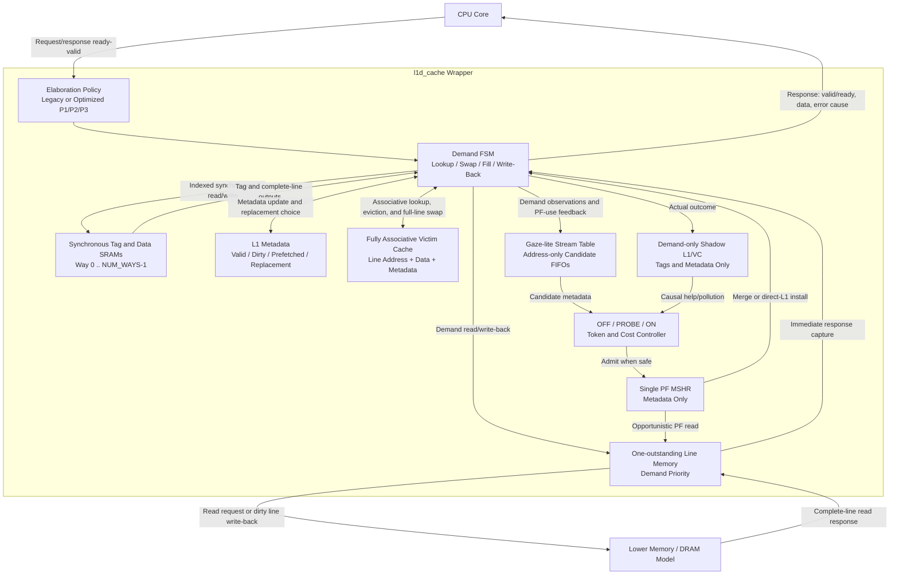

# Baseline L1 数据缓存

## 当前状态

本文档是 L1 数据缓存的中文说明副本；英文
`docs/l1d_baseline.md` 是权威版本。至 2026-07-22，`l1d_cache`
仍是可选择两个 write-back、write-allocate engine 的 elaboration-time
研究 wrapper：

- `PREFETCH_POLICY=0` 选择冻结的 legacy blocking next-line engine；
- `PREFETCH_POLICY=1` 选择 optimized direct-L1 研究 engine，也是研究
  wrapper 的默认值；
- `PF_OPT_LEVEL=1/2/3` 分别选择安全 next-line、自适应相邻 stream、
  shadow feedback + 单 PF MSHR；默认为 3。

两个 engine 共同支持：

- RV64 load/store 请求约定，使用 64 位字节地址和 XLEN 数据宽度；
- byte、halfword、word、word-unsigned 和 doubleword load 语义，并支持
  符号扩展或零扩展；
- byte、halfword、word 和 doubleword store 语义，并报告对齐错误；
- 可配置的直接映射或 2 路组相联结构；
- 同步 tag/data SRAM wrapper；
- CPU 与缓存行内存侧 ready/valid 接口；
- 管理脏行驱逐和缓存行分配的 FSM；
- 参数化全相联 victim cache；
- 不增加长期 line-sized buffer 的 direct-L1 prefetch；
- legacy 计数器，以及 schema-3 candidate、issue、return、install、merge、
  discard、suppression、controller、shadow 和 block-cost telemetry；
- Icarus Verilog 自检测试和 Vivado batch 入口。

面向板级综合的 seam 是 `l1d_cache_deploy`。它默认
`ENABLE_PREFETCH=0`、`PF_OPT_LEVEL=1`，并通过常量折叠禁用所有可选
prefetch 结构。Full P3 和 P3-lite 必须显式选择，仍属研究 profile。
`l1d_fpga_harness` 为 Vivado 提供可放置的标量 I/O top，而不是把完整
line interface 暴露为器件引脚。

Icarus Verilog 用于快速功能检查。Vivado XSim、OOC synthesis、独立
post-route implementation、timing 和基于 activity 的 power 是最终 FPGA 证据。

7 月 22 日主 replay 在相同 25 个 zero-bubble window 上验证了 legacy、
P1、P2、full P3 和 P3-lite。Full P3 节省 1 个 aggregate service cycle；
P3-lite 增加 31 cycle。两者的 byte overhead 和 prefetch-caused write-back 都为
零，但均未达到 1% improvement 门禁。P3-lite 还未通过面积、setup timing、
activity power 和按实际频率折算的执行时间门禁，因此部署默认保持
prefetch-off。详见 [7 月 22 日无地址证据](../evidence/2026-07-22-prefetch-ppa/README.md)。

## 源码结构

| 路径 | 用途 |
| --- | --- |
| `src/l1d_sram.sv` | 单端口同步 SRAM 推断 wrapper |
| `src/l1d_next_line_prefetch.sv` | 冻结的单 entry legacy next-line candidate generator |
| `src/l1d_cache_legacy.sv` | 冻结的 legacy blocking next-line engine |
| `src/l1d_stream_prefetch.sv` | 四 entry 相邻 stream detector 与两 entry metadata-only candidate FIFO |
| `src/l1d_prefetch_controller.sv` | 带滞回的 OFF/PROBE/ON controller 与 token bucket |
| `src/l1d_shadow_cache.sv` | Demand-only tag/dirty counterfactual L1/VC model |
| `src/l1d_cache_optimized.sv` | 安全 direct-L1 insertion、lifecycle telemetry、shadow feedback 与单 PF MSHR |
| `src/l1d_cache.sv` | Legacy/optimized elaboration-time wrapper；optimized level 3 为默认 |
| `src/l1d_cache_deploy.sv` | 部署 seam；prefetch-off 默认与显式结构 feature 参数 |
| `src/l1d_fpga_harness.sv` | 用于独立 implementation 和 activity power 的标量 I/O FPGA harness |
| `src/tb_l1d_cache.sv` | 自检 testbench 和缓存行内存模型 |
| `src/tb_l1d_cache_oop.sv` | Class-based Vivado Phase 3 workload harness |
| `src/tb_l1d_fpga_harness.sv` | Deploy profile signature 和 SAIF activity testbench |
| `scripts/run_iverilog.sh` | 功能与 synthetic workload 初步回归 |
| `scripts/summarize_workloads.sh` | 将 workload 日志记录转换为 CSV |
| `scripts/validate_workload_results.py` | fail-closed 的 schema-2/schema-3 字段与 counter 守恒验证器 |
| `scripts/run_prefetch_unit_tests.sh` | Stream detector 与 controller 定向回归 |
| `scripts/run_p3_tests.sh` | P3 shadow/MSHR、zero-bubble、TTL、EWMA 与 response-lifetime 回归 |
| `scripts/run_vivado.tcl` | Vivado 仿真、综合、资源、时序与功耗报告 |
| `scripts/run_remote_vivado.py` | 用于 Windows host 的 Paramiko 远程 Vivado runner |
| `scripts/generate_phase3_traces.py` | 确定性 Phase 3 trace generator |
| `scripts/capture_spec_qemu_windows.py` | fail-closed 的逐命令 RV64 QEMU 抓取与私有 manifest |
| `scripts/split_qemu_memtrace_windows.py` | 验证 schema-v3 raw capture 并生成 canonical 分阶段 replay window |
| `scripts/run_spec_trace_replay.sh` | manifest 驱动的四配置 replay 与 paired analysis |
| `scripts/run_feedback_replay_matrix.sh` | 可恢复、串行的 7 月 22 日 main/sweep/sensitivity campaign matrix |
| `scripts/summarize_spec_replay.py` | 严格验证 artifact、counter、sidecar 与 off/on pair |
| `scripts/evaluate_prefetch_evidence.py` | Replay 与 Vivado 部署门禁评估器 |
| `scripts/publish_prefetch_evidence.py` | 无地址证据发布器和隐私审计 |
| `scripts/render_spec_replay_plots.py` | 确定性 helpful/neutral/harmful 分类 CSV 与 cycle-delta SVG |
| `scripts/analyze_trace_windows.py` | locality、stride、reuse distance 与 set pressure 分析 |
| `constraints/l1d_baseline.xdc` | 默认 100 MHz 综合时钟约束 |
| `traces/smoke.trace` | 可重新分发的 trace replay 格式 smoke test |
| `traces/generated/MANIFEST.md` | Generated Phase 3 trace hash |
| `docs/phase3_vivado_report.md` | 当前 Vivado Phase 3 证据和剩余缺口 |

所有 SystemVerilog 文件均位于 `src/` 下。

## 架构与 Block Diagram

Optimized 研究路径保留 CPU 和下级内存协议，但将 speculative
control 与 demand service 分离：

- CPU request 和 response 分别使用独立的 ready/valid handshake；
  `cpu_req_ready` 属于 request channel，而 `cpu_rsp_valid` 和
  `cpu_rsp_ready` 属于 response channel；
- hit/miss 由 tag、valid metadata 和全相联 victim lookup 决定，不是由
  data array 决定；
- candidate 只含地址和 attribution metadata；返回数据仅使用现有
  transient refill register，然后 merge demand、直接安装 L1 或 discard；
- victim entry 保存完整 line address、line data、valid、dirty 和
  prefetched metadata；victim hit 会同时交换数据与 metadata；
- dirty victim replacement 通过 controller write-back state 发送，不是
  victim cache 直接访问内存；
- demand SRAM access 始终优先；PF read 在途时，无关 L1/VC hit
  仍可正常完成；
- 下级内存仍最多只有一个 outstanding read，不引入 transaction ID；
- tag-only shadow cache 在实际 demand outcome 后更新，不在 CPU response
  关键路径上。

修正后的 implementation-level diagram 如下。为避免 Mermaid 中文渲染问题，
图中统一使用英文：



Optimized 路径不允许 speculative line 驱逐 dirty demand data，也不允许
引发 dirty victim-cache write-back。Prefetch cold insertion，每 set 最多一条
unused speculative line；该 line 被替换时直接 discard，不进入 VC。

## 参数

| 参数 | 默认值 | 约束或含义 |
| --- | ---: | --- |
| `ADDR_WIDTH` | 64 | RV64 字节地址宽度 |
| `DATA_WIDTH` | 64 | RV64 XLEN 数据宽度 |
| `LINE_BYTES` | 16 | `DATA_WIDTH/8` 的 2 次幂倍数 |
| `NUM_SETS` | 8 | 至少为 2 的 2 次幂 |
| `NUM_WAYS` | 2 | `1` 表示直接映射，`2` 表示 2 路 |
| `VICTIM_ENTRIES` | 4 | 非零的 2 次幂，目标范围为 4 至 8 |
| `ENABLE_PREFETCH` | 1 | elaboration-time 的 built-in/external prefetch 接收开关；仍受 runtime enable 控制 |
| `PREFETCH_POLICY` | 1 | `0` 冻结 legacy 行为；`1` 选择 optimized engine |
| `PF_OPT_LEVEL` | 3 | `1` safe next-line；`2` adaptive stream；`3` shadow feedback + PF MSHR |

上述默认值属于为保持研究兼容而留下的 `l1d_cache`。
`l1d_cache_deploy` 则默认 `ENABLE_PREFETCH=0`，并将 `PF_USE_STREAM`、
`PF_USE_ADAPTIVE`、`PF_USE_SHADOW` 和 `PF_USE_MSHR` 暴露为独立
elaboration 参数。被禁用的结构会在综合后消失，而不是只被保持在 reset。
其注册化 PF scheduler 使用 S0 capture 和 S1 request 两级；下级内存请求只由
已注册 MSHR payload 驱动，因此可在任意多个 `mem_req_ready=0` cycle 中保持稳定。
显式 lower-port grant 使 state-owned demand read 与 write-back 具有优先权；只有
总线 payload 确为已注册 PF request 时，PF issue、token 与 cost 记账才会前进。

部署选择 `VC_FORMAT_IN_SWAP=1`。OOC A/B 结果为：swap-stage format 使用
6,048 LUT、2,047 register、WNS +0.363 ns；lookup-stage format 使用 5,647 LUT、
2,034 register、WNS -0.675 ns。虽然前者逻辑更多，但它是唯一闭合 10 ns
OOC setup 的 PF0 变体，因此保留。

### 瞬态 Line Register 生存期

本次没有添加持久的 line-sized prefetch buffer。现有 line-width register 的状态
所有权不同，不能安全合并：

| Register | 生存期与 owner | 不能复用的原因 |
| --- | --- | --- |
| `data_q[way]` | 当前已发起 set lookup 的同步 SRAM read output | 下一次 array read 会改变它，不是跨 arbitration 的存储。 |
| `working_line` | Demand hit-write 或 victim swap 副本，持续到 `ST_HIT_WRITE`/`ST_VC_SWAP` | 并发 PF response 会在 array write 或 response format 完成前破坏 demand data。 |
| `fill_line` | 唯一的瞬态 lower-read response，从 capture 持续到 demand install、PF merge/install 或有界 discard | 它已是共享 response register；如果 arbitration 在两个 cycle 内无法消费 PF response，就会 discard。延长它的生存期就等于新增 prefetch buffer。 |
| `evicted_data` | 从 lookup/revalidation 到 VC insertion 或 swap 的 replacement-line snapshot | 覆盖它会丢失必须保存或归因为 unused 的精确缓存行。 |
| `wb_data` | 在下级内存 write handshake 期间保持的 dirty victim snapshot | 别名复用会在 `mem_req_ready` 为低时违反 request payload 稳定性。 |

这些生存期在 demand/PF merge 和 eviction 路径上会重叠。因此复用另一个
register 会导致数据破坏或协议不稳定，而不是消除冗余存储。真正的 buffer
或更宽的内存 transaction interface 属于架构变更，不在本次收尾授权范围内。

Demand 替换是每 set round-robin。Optimized prefetch admission 依次选择
invalid way、unused-prefetched way，然后仅当 confidence=3 且 VC 有 invalid
entry 时选择 clean demand way。Prefetch fill cold insertion，立即成为下一 victim。

External `valid && ready` 表示对齐 candidate 进入一 entry external skid；
之后仍可 TTL 过期、cancel、suppress 或在 response 返回后 discard。Legacy
policy 0 保留历史 handshake 语义。Optimized 模式中 `cfg_next_line_enable`
控制内建 stream detector，`cfg_prefetch_enable` 仍是 runtime master。

## 接口约定

### CPU 请求与响应

上升沿满足 `cpu_req_valid && cpu_req_ready` 时接收请求。请求字段包括：

- `cpu_req_addr`：字节地址；
- `cpu_req_write`：`0` 表示 load，`1` 表示 store；
- `cpu_req_size`：`0` byte、`1` halfword、`2` word、`3` doubleword；
- `cpu_req_unsigned`：对小于 XLEN 的 load 选择零扩展；store 和
  doubleword load 会忽略该字段；
- `cpu_req_wdata`：未移位的 store 数据，低位字节由 `cpu_req_size` 选择。

同一时间 demand engine 只接收一个请求。Optimized level 3 中，PF read
在途时无关 L1/VC hit 可完成，同地址 demand miss 则 merge 到 PF MSHR。
`cpu_rsp_valid` 会保持到
`cpu_rsp_ready` 接收响应。load 在 `cpu_rsp_rdata` 返回 RV64 架构结果：
`LB/LH/LW` 符号扩展，`LBU/LHU/LWU` 零扩展，`LD` 返回完整 64 位。store
也会产生完成响应，返回值是按 store size 选出的写后值，调用方通常忽略。

对齐规则遵循 RV64 自然对齐：

| Access size | 合法地址对齐 |
| --- | --- |
| byte | 任意字节地址 |
| halfword | `addr[0] == 0` |
| word | `addr[1:0] == 0` |
| doubleword | `addr[2:0] == 0` |

未对齐 CPU 请求会被接收并返回错误，不会访问 cache array 或下级内存。
`cpu_rsp_error` 会置位，`cpu_rsp_error_cause` 为 `1` 表示 load address
misaligned，为 `2` 表示 store address misaligned。当前没有实现对未对齐
访问的硬件拆分。

### 下级缓存行内存接口

下级接口按完整缓存行传输：读请求使用 `mem_req_valid`、`mem_req_ready`、
`mem_req_write=0` 和对齐的 `mem_req_addr`；读数据随后以
`mem_rsp_valid` 脉冲和 `mem_rsp_rdata` 返回；write-back 使用
`mem_req_write=1` 和 `mem_req_wdata`。当前 baseline 假设写请求被
`mem_req_ready` 接收后即完成，没有单独的写响应和错误通道。

## FSM 与数据流

主要状态如下：

1. `ST_IDLE`：按 CPU（包括 misaligned request）、external prefetch、等待中的
   built-in next-line prefetch 顺序严格选择一个请求。
2. `ST_LOOKUP`：使用同步 SRAM 输出比较所有 L1 way 和 victim entry。
3. `ST_HIT_WRITE`：提交带字节使能的 store hit。
4. `ST_VC_SWAP`：将 victim hit 的行提升到 L1，并把选中的 L1 行放入同一
   victim entry。
5. `ST_WB_REQ`：写回即将被替换的脏 victim 行。
6. `ST_VC_INSERT`：将 L1 驱逐行放入 victim cache。
7. `ST_MEM_READ_REQ` / `ST_MEM_READ_WAIT`：请求并等待缓存行填充。
8. `ST_INSTALL`：安装 demand 或 prefetch 缓存行。
9. `ST_RESP`：保持 CPU 响应直到被接收。

同步 SRAM 读在 `ST_IDLE` 发起，在 `ST_LOOKUP` 使用 tag/data 输出。
valid、dirty 和 prefetched metadata 由独立寄存器保存。

## Write-Back / Write-Allocate

- store hit 更新由 `cpu_req_size` 选中的连续 byte、halfword、word 或
  doubleword，并将 L1 行标记为 dirty；
- store miss 先读取完整缓存行，再合并选中的 store 字节并以 dirty 状态
  安装；
- L1 替换首先把缓存行移动到 victim cache；
- 若目标 victim entry 中已有 dirty 行，先将其写回下级内存；
- victim hit 直接交换 victim 与 L1 的数据和 metadata，不立即写回脏行。

这种延迟 write-back 行为是 baseline 中降低 conflict miss 代价并保证脏
数据不丢失的核心机制。

## Victim Cache

Victim cache 是全相联结构，并行比较对齐后的缓存行地址。每个 entry 保存
valid、dirty、prefetched、地址和完整缓存行数据，采用 round-robin 替换。

Demand victim hit 时：

1. victim 行进入选中的 L1 way；
2. 有效的 L1 被替换行进入命中的 victim slot；
3. 若 L1 选择的是 invalid way，则 victim slot 失效；
4. CPU 操作作用于提升后的缓存行。

Testbench 对直接映射和 2 路配置都验证了 victim rescue，并验证 dirty 行
在 victim cache 继续承受替换压力后最终正确写入 backing memory。

## Next-Line Prefetch 与监控

Demand fill 完成后，缓存排队请求下一条对齐缓存行。在 `ST_IDLE` 中，接收
顺序为 CPU demand、external prefetch、pending built-in next-line candidate。
任何置位的 CPU 请求都会占用该周期，包括随后返回架构错误的未对齐请求，
因此两个 producer 不会同时观察到同一 slot 的握手。若目标行已存在于 L1
或 victim cache，则不会重复读取。

监控计数器包括：

| 计数器 | 含义 |
| --- | --- |
| `stat_prefetch_fills` | 安装到 L1 的 prefetch 行 |
| `stat_prefetch_useful` | 之后被 CPU 使用的 prefetch 行 |
| `stat_prefetch_useless` | 未被 CPU 使用且最终在 victim cache 中被覆盖的 prefetch 行 |
| `stat_prefetch_pollution` | 导致 demand L1 行被移出的 prefetch 分配 |
| `stat_prefetch_dropped` | built-in 单 entry 队列已满时丢弃的 candidate |

`stat_prefetch_pollution` 是 displacement pressure proxy，不等同于性能一定
下降，因为被移出的行可能仍由 victim cache 救回。Replay sidecar 会记录每次
demand outcome；严格的 off/on 配对按相同的 `(sequence, address, operation,
size)` identity 统计真实 L1/lower-memory help 与 pollution。只有 aggregate
miss delta 时只能得到净效应。

### Adaptation 接口

`cfg_prefetch_enable` 是运行时 master switch，
`cfg_next_line_enable` 只控制 built-in next-line generator。
关闭 built-in generator 会清除 pending candidate，重新启用后不会发出旧
workload phase 中学习到的地址。外部策略可通过
`ext_prefetch_valid`、`ext_prefetch_ready` 和 `ext_prefetch_addr` 注入
candidate，缓存会把被接收的地址对齐到缓存行。

单周期 event 输出报告 CPU access/hit/miss、victim hit、write-back，以及
prefetch fill/useful/useless/pollution/drop，供后续 adaptive controller 和
verification monitor 使用。累计计数器继续用于软件可见或仿真结束统计。

研究依据和 direct L1 prefetch insertion 的限制见
`docs/literature_review.md`。

## Icarus 初步验证

运行：

```bash
./scripts/run_iverilog.sh
```

脚本包含定向测试、内存接口 backpressure、CPU response backpressure、
握手 payload 稳定性检查、160 次操作的 deterministic randomized
golden-memory scoreboard、未对齐 demand 与 external/pending prefetch 的
仲裁，以及持续 demand 下的 drop 计数，并运行四种 geometry/workload 配置：

| 配置 | 覆盖内容 | 结果 |
| --- | --- | --- |
| 直接映射，8 sets，VC4，关闭 prefetch | RV64 load/store size、相同 128-byte L1 容量、未对齐错误、victim hit、dirty preservation、随机流量 | PASS |
| 2 路，4 sets，VC4，关闭 prefetch | 相同 128-byte L1 容量、way replacement、backpressure、五种 boundary profile、trace smoke | PASS |
| 2 路，4 sets，VC8，关闭 prefetch | 独立比较 victim capacity，并检查 dirty preservation | PASS |
| 2 路，4 sets，VC4，开启 prefetch | next-line/victim/external 行为、仲裁回归、fill/use/resident/drop 守恒 | PASS |

生成的 `.vvp` 和日志位于 `sim/`。Icarus 会输出关于 `always_*` constant
select 的提示信息，但编译和全部自检均成功。

每个 optimized workload 都会输出一行机器可读的
`WORKLOAD_RESULT schema=3`；显式选中的冻结 legacy policy 输出 schema 2。
`scripts/summarize_workloads.sh` 将这些记录汇总到被忽略的
`sim/workload_results.csv`。记录字段包括 access、hit、miss、victim hit、
完整 geometry/capacity、分别统计的 demand/prefetch 下级读、read/write
bytes、真实 prefetch fills、useful/useless-evicted/unused-resident 守恒、
drop/protocol counter，以及 replay service cycle。

## Vivado 验证证据

### 7 月 22 日部署收尾

最终远程 Vivado 2024.2.1 执行退出状态为 0。证据收集器验证了 15 份
XSim log、8 个 OOC synthesis 配置、4 个独立 post-route implementation、
SAIF-backed power report 和 121 个下载的 log/report 文件。
`l1d-vivado-evidence-v3` manifest 为 `PASS`，finding 为零。预期的
`[Timing 38-282]` setup 门禁 warning 由数值报告评估；其他任何 critical warning
仍会使收集失败。

受控 PF0/P3-lite 比较为：

| 阶段 / 指标 | Optimized PF0 | P3-lite | 结果 |
| --- | ---: | ---: | ---: |
| OOC slice LUT | 6,048 | 10,055 | +66.25% |
| OOC register | 2,047 | 3,095 | +51.20% |
| 10 ns OOC WNS | +0.363 ns | -5.896 ns | P3-lite setup 失败 |
| Post-route slice LUT | 751 | 2,955 | +293.48% |
| Post-route register | 748 | 2,280 | +204.81% |
| Post-route WNS | -0.407 ns | -4.169 ns | 两者均失败，P3-lite 更差 |
| Post-route WHS | +0.118 ns | +0.065 ns | 两者 hold 通过 |
| Activity dynamic power | 0.008 W | 0.015 W | +87.5% |

所有 implementation 变体的 unconstrained path 都为零。综合门禁决策为
`DISABLE_DEPLOY_PREFETCH_STRUCTURAL_LIMIT`：P3-lite 在主 replay 中还增加
31 cycle，其 stream detector 占据主要面积与关键路径。参数调整及删除
adaptive/shadow 结构都没有消除该结构成本。完整表格与 provenance 见
[7 月 22 日证据包](../evidence/2026-07-22-prefetch-ppa/README.md)。

### Optimized P3 证据（历史 7 月 13 日结果）

最终 optimized 远程 campaign 已在 Vivado 2024.2.1 下通过。它生成了
11 份 XSim log：8 个 class-based OOP workload point 和 3 个定向
auxiliary top。8 份 OOP log 包含 83 行 `WORKLOAD_RESULT schema=3`；
每行都报告 `status=PASS`、watchdog/protocol/duplicate-line error 为零，
并在 drain 后满足 prefetch 生命周期守恒。3 份 auxiliary log 通过了
76 个 stream/controller check、62 个 PF-MSHR check 与 optimized P3 edge
scenario。同一次运行综合了 4 个受控配置，并下载了全部
12 份 utilization/timing/power report。最终 manifest 报告 `PASS`、
无 finding、远程退出状态为 0、无下载失败，并对一份 901,858-byte
代表性 VCD 记录了哈希。这表示 simulation/流程/artifact 验证通过，
而不是 100 MHz timing 闭合声明。

OOP matrix 使用 sequential producer，它是功能与生命周期证据。
真正的 zero-bubble 操作由 `tb_l1d_cache_optimized_p3`
（远程名为 `p3_prefetch_edges`）在 Icarus 和 XSim 中跨仿真器测试。
P3 主要性能结果来自本地真正 zero-bubble 的 25-window trace campaign，
而不是 sequential OOP result row。

当前综合后 PPA 如下：

| 配置 | LUT | LUT as memory | FF | Block RAM tile | Bonded IOB / 可用数 | 10 ns 下 WNS | 近似 Fmax | Vectorless power |
| --- | ---: | ---: | ---: | ---: | ---: | ---: | ---: | ---: |
| `dm_s8_vc4_pf0` | 5,679 | 57 | 2,897 | 2 | 1,447 / 106 | -1.019 ns | 90.752 MHz | 0.124 W |
| `2w_s4_vc4_pf0` | 7,137 | 372 | 3,214 | 0 | 1,447 / 106 | -2.130 ns | 82.440 MHz | 0.125 W |
| `2w_s4_vc8_pf0` | 7,891 | 372 | 4,227 | 0 | 1,447 / 106 | -2.500 ns | 80.000 MHz | 0.128 W |
| `2w_s4_vc4_pf1` | 10,882 | 372 | 4,757 | 0 | 1,510 / 106 | -9.342 ns | 51.701 MHz | 0.139 W |

与匹配的 `2w_s4_vc4_pf0` 相比，启用 optimized P3 增加 3,745 个
LUT（52.473%）和 1,543 个 FF（48.009%），WNS 恶化 7.212 ns，
综合后 Fmax 估算下降 30.739 MHz，vectorless power 增加 0.014 W。
4 个配置都未通过 100 MHz setup timing，但 hold 都通过。这些是
综合后数据，不是 implementation/post-route 结果。Raw cache top 还需要
1,447 或 1,510 个 bonded I/O，而可用数只有 106，因此当前综合形式
并不是可放置的板级 top。Vectorless power confidence 为 `Low`；
基于实际 activity 的功耗分析仍待完成。完整当前与历史表格见
`docs/phase3_vivado_report.md`。

### 先前 legacy 证据与复现

先前 legacy-engine RV64 Vivado 证据记录在 `docs/phase3_vivado_report.md` 中。
2026-07-13 的无旧报告混入 legacy 替代运行使用远程 Vivado 2024.2.1，并在 XSim 与
synthesis 中共用显式 geometry。运行成功退出，并扫描了恰好 22 份
log/report：8 份 simulation log、12 份 synthesis report、Vivado log 与
Vivado journal。代表性 waveform 另行验证。最终生成的证据 manifest
状态为 `PASS`，其中记录 10.0 ns 时钟与所有输入和证据 artifact 的
SHA-256。

在 Vivado 已加入 `PATH` 的机器上，可用以下命令运行本地 Vivado 入口：

```tcl
vivado -mode batch -source scripts/run_vivado.tcl
```

脚本默认目标器件为 `xc7a35tcpg236-1`，可用环境变量 `L1D_PART` 覆盖。
脚本运行 class-based OOP XSim 矩阵、trace replay、低/高 latency optimized
prefetch case、3 个定向 auxiliary top，并使用 10 ns 时钟约束
综合四种主要硬件配置，在
`build/vivado/reports/<configuration>/` 下生成：

- `utilization.rpt`；
- `timing_summary.rpt`；
- `power.rpt`。

仿真日志和代表性 VCD 会复制到 `build/vivado/reports/`。先前 legacy Phase 3 综合
结果如下：

| 配置 | LUT | FF | Block RAM tile | 10 ns 下 WNS | 综合后近似 Fmax | Vectorless power |
| --- | ---: | ---: | ---: | ---: | ---: | ---: |
| 直接映射，8 sets，VC4，关闭 prefetch | 5,189 | 1,852 | 2 | -1.581 ns | 86.3 MHz | 0.114 W |
| 2 路，每路 4 sets，VC4，关闭 prefetch | 5,699 | 2,246 | 0 | -2.068 ns | 82.9 MHz | 0.106 W |
| 2 路，每路 4 sets，VC8，关闭 prefetch | 5,783 | 3,004 | 0 | -1.516 ns | 86.8 MHz | 0.106 W |
| 2 路，每路 4 sets，VC4，开启 prefetch | 6,222 | 2,407 | 0 | -1.626 ns | 86.0 MHz | 0.111 W |

这些 legacy RV64 配置的逻辑 L1 data capacity 均为 128 bytes，且都
未满足 100 MHz 综合约束。Vivado 为 direct-mapped array 推断了 2 个
block RAM tile，却将所有 2-way 配置中深度更浅的每路 array 映射为
distributed logic/register。逻辑 capacity 已受控，但物理 memory mapping
仍不一致；因此 LUT/FF/timing 差异不能只归因于 associativity。Fmax
按 `1000 / (10 - WNS)` 计算，只是综合后 STA 估算；布局布线后
结果可能下降。

功耗值使用 Vivado vectorless activity propagation，没有 SAIF/VCD activity
文件，采用默认 operating condition，且置信度为 `Low`。这些数据只能作为
早期相对估算。顶层 I/O 数量也很高，因此不能把它们视为板级功耗预测。

这些历史报告不表征 optimized P3。升级后的 11-log XSim 和四 geometry
synthesis/PPA 运行现已完成，并在上文单独报告；历史 legacy 数据保持不变。

Windows 上应使用纯 ASCII 工程路径。Vivado 仿真可以在中文用户目录下运行，
但综合子进程无法重新打开包含非 ASCII 字符的工程路径。

最终签核前仍需检查所有 FSM 路径的 XSim 波形，并执行 implementation/
post-route timing。为了获得有意义的功耗比较，还应使用 workload trace
产生的代表性 switching activity 重新运行 `report_power`。代表性通过的 optimized
VCD 为 `build/vivado/reports/2w_s4_vc4_pf1.vcd`。机器可读的验证记录为
`build/vivado/evidence_manifest.json`。

## Workload-Driven Boundary Analysis

### Benchmark 基础

SPEC CPU 2017 用作兼容性和历史对比 baseline。2026 年 5 月 5 日发布的
SPEC CPU 2026 是当前主要目标。SPEC 官方页面分别说明 CPU 2017 包含 43
个 benchmark，CPU 2026 包含 52 个 benchmark，并都分为整数/浮点和
speed/rate 套件。

来源：

- [SPEC CPU 2017](https://www.spec.org/cpu2017/)
- [SPEC CPU 2026](https://www.spec.org/cpu2026/)

两套 benchmark 都受许可证约束。符合条件的认证高校可由教授或全职员工
申请免费的 SPEC CPU 2026 学术许可证。不得把 benchmark 源码或专有输入
数据提交到本仓库。

当前本地状态：capture 预期获许可 SPEC CPU 2026 tree 位于 guest 内的
`/home/debian/spec2026`。Debian RV64 VM 默认使用项目内的 `debian-rv64/`
directory，可用 `L1D_QEMU_VM_DIR` 覆盖。获许可 raw trace、replay window、
log、sidecar 和 manifest 全部保留在被忽略的 `build/` 下。公开仓库
不跟踪任何 SPEC-derived trace。

### 基于 Trace 的 RTL 方法

在 RTL testbench 中直接运行完整 SPEC 程序并不现实。当前实现采用：

1. 在 host 或体系结构 simulator 中构建并运行获得许可的 SPEC workload；
2. 只捕获选定 timed command 的 U-mode memory operation，使用物理地址并
   删除全部 store data；
3. 先通过 count pass 选择有限 warmup/measurement window，再在新的 snapshot
   capture pass 中复现相同总事件数；
4. 将私有 window 通过 CPU 接口回放；
5. 比较等容量 `dm_s8_vc4_pf0` 与 `2w_s4_vc4_pf0`、独立的
   `2w_s4_vc8_pf0` victim-capacity point，以及唯一严格 prefetch pair
   `2w_s4_vc4_pf0` 与 `2w_s4_vc4_pf1`；
6. 只发布派生统计和许可证允许重新分发的 trace metadata。

使用 `+TRACE=<path>` 选择可复用 replay driver。每行格式为：

```text
# 注释以 # 开始
0 SIZE UNSIGNED ADDRESS
1 SIZE 0 ADDRESS DATA
```

`0` 表示 load，`1` 表示 store。`SIZE` 为十进制：`0` byte、`1`
halfword、`2` word、`3` doubleword。`UNSIGNED` 为十进制，仅 load 使用。
地址和数据是不带 `0x` 前缀的十六进制。load 会按请求的符号扩展或零扩展
与 testbench golden memory 比较；store 在 cache 完成后更新 golden
memory。空行和注释行会被忽略。例如，先用
`scripts/run_iverilog.sh` 构建 canonical matrix，再执行：

```bash
vvp sim/2w_s4_vc4_pf0.vvp \
  +TRACE=traces/smoke.trace \
  +TRACE_ID=smoke +CONFIG_ID=2w_s4_vc4_pf0
```

该命令需要从仓库根目录运行。使用 ASCII 相对路径可以避免 Icarus 在工作区
绝对路径包含非 ASCII 字符时的 plusarg 限制。当前 extraction 流程会将
committed access 转换为该 cache interface 格式。自然对齐访问保留 RV64 size；
位于同一 16-byte cache line 内的未对齐访问转为一条 byte-sized line touch；
跨 line 访问转为两条 byte-sized touch，并独立翻译最后一个 byte。Manifest
同时记录 source-event 与展开后 replay-access 数，不会静默过滤任何访问。
受许可保护的 data value 会被省略。

当 replay 来自真实程序时，`+TRACE_SKIP_LOAD_CHECKS` 会保留每条 load/store
地址，但关闭与 synthetic golden-memory image 的比较。应优先使用
manifest-driven runner，而不是手写 `vvp` 命令。

### 当前可归因的 capture 与 replay 流程

Host plugin 严格要求 QEMU 11.0.1、Plugin API 6、`riscv64` system emulation
和单一 vCPU。VM 使用 `-snapshot`，不会修改基础磁盘或 UEFI variable。动态
链接的 timed command 由 `libl1d_roi.so` 包装，并在 `a0..a5` 中发出带版本
marker ABI：magic/version、随机 nonce、start/stop event、command index、
PID 与 TID。Plugin 锁定 vCPU 0、U privilege 和 marker 中的 non-Bare `satp`。
Kernel access 与其他 U-mode address space 会被忽略并计数，只有绑定 SATP
计入 source event。Plugin 记录物理地址；malformed/mismatched marker、目标 IO、
不支持的 size、缺少物理地址（包括无法独立翻译跨 line 访问末尾）、window
不完整或 count/capture 不一致都会使 capture fail closed。
`trace_exec` 还会在 target `exec` 前设置并验证 `ADDR_NO_RANDOMIZE`；无法关闭
ASLR 会使 unit 失败。Splitter 会独立检查 context/start/stop/summary identity
链，并把每条 payload row 绑定到 ROI 的 SATP、vCPU 与 privilege。

若 ROI 至少包含 50,000 条支持的事件，则在 source event stream 的
10%、30%、50%、70%、90% 位置选取五个不重叠 window；每个 source window
先包含 5,000 条 demand-only warmup event，再包含 5,000 条 measurement event。
Manifest 分开记录 source event 与跨 line 展开后的 canonical replay access。更短的
ROI 整体 replay，并标为 `whole-roi-short`，不得描述成已经 demand-warmed。

从仓库根目录运行：

```bash
scripts/build_qemu_memtrace_plugin.sh
python3 scripts/capture_spec_qemu_windows.py \
  --out-dir build/spec2026/qemu-private \
  --size test --label codexrv64 \
  708.sqlite_r 721.gcc_r 767.nest_r 777.zstd_r
scripts/run_spec_trace_replay.sh \
  build/spec2026/qemu-private/campaign_manifest.json \
  build/spec2026/replay/logs
```

Capture campaign 与每个 unit manifest 都必须为 `PASS`、`valid=true` 且
hash 完整。每个 count/capture snapshot 还会先清除 SPEC `compare.cmd` 中声明的
全部输出，运行一个 timed command，再在 ROI stop 后要求该命令实际生成输出对应的
精确 comparison 子集通过。两个 pass 必须选择相同子集，且两份子集文件和 log
均会哈希。逐 benchmark plan 绑定原始 timed-command 文件、连续 command index
及完整 comparison plan 的精确互斥分区。Campaign provenance 会哈希实际 QEMU
binary、不可变 VM/firmware input、target ELF、plugin 与全部 host capture source；
完整临时证据图必须先通过验证，才能发布 PASS。Replay runner 只消费
这些 manifest，拒绝 stale 或额外 trace，编译四个明确 geometry，记录
binary/simulator/command/cwd hash 与 identity，并调用
`summarize_spec_replay.py`。当前默认值为 optimized P3、真正的 zero-bubble
和 schema 3。Schema-3 sidecar 记录 demand present/accept/response，以及
prefetch candidate/admit/issue/return/install/use/evict/cancel/discard/merge、controller、
suppression 和 write-back attribution event。Analyzer 也接受保留的 schema-2 legacy
证据，并针对每个 schema 验证对应的 lifecycle 守恒规则。

Direct-mapped 与 VC8 配置是独立比较点，不是 prefetch pair。有效 pair
会生成 `classification.csv` 和 `cycles-on-minus-off.svg`；仅按
`cycles_on_minus_off` 的符号分类：负值为 helpful、零为 neutral、正值为
harmful。系统已测量 aggregate lifecycle 和 demand latency，但 PF event row 还没有
共享 transaction ID，因此逐 prefetch candidate-to-issue-to-return latency 仍是独立的
future measurement。

当前 optimized 主结果和 sensitivity 结果是新默认的权威证据，记录在
[optimized 证据包](../evidence/2026-07-13-optimized/README.md)。要复现下方冻结的
sequential legacy 结果，需要显式覆盖：

```bash
L1D_PREFETCH_POLICY=0 L1D_PF_OPT_LEVEL=0 \
L1D_PRODUCER_PROFILE=sequential L1D_SIDECAR_SCHEMA=2 \
scripts/run_spec_trace_replay.sh \
  build/spec2026/qemu-private/campaign_manifest.json \
  build/spec2026/replay-legacy/logs
```

#### 2026 年 7 月 13 日冻结 legacy baseline

私有 campaign 已在 `708.sqlite_r`、`721.gcc_r`、`767.nest_r` 和
`777.zstd_r` 上通过。5 个 command unit 生成 25 个采样 window，
count/capture 总数一致，进程身份有效，物理地址合法，且零 violation。

5 个 ROI 包含 11,726,347,548 个 source event。Cross-line 展开增加
11,104,621 个 access，得到 11,737,452,169 个 canonical access。
250,000 个采样 source row 展开为 250,971 个 replay payload record。

Manifest-driven replay 完成 100 次运行：25 个 window 各有 4 种配置。
这得到 25 对严格的 `2w_s4_vc4_pf0`/`2w_s4_vc4_pf1` pair，
以及 50 次独立 direct-mapped 或 VC8 运行。Analyzer 验证为 `PASS`。

| Pair | Accuracy | L1 coverage | 下级 coverage | 带宽开销 | Bytes on-off | Service cycles on-off | Harmful / neutral / helpful |
| ---: | ---: | ---: | ---: | ---: | ---: | ---: | --- |
| 25 | 0.215690268 | 0.049647522 | 0.067245888 | 0.537997464 | 672,032 | 328,996 | 25 / 0 / 0 |

Paired sidecar 识别出 8,079 次真实 L1 help 和 4,776 次真实 L1
pollution，以及 9,018 次下级内存 help 和 5,032 次下级内存
pollution。Prefetch read 与 fill 均为 44,193，其中 9,532 次 useful。

每个 pair 都增加了串行 replay service cycle。该分类仅适用于这些
采样 window、固定 blocking memory model 和当前 next-line policy，
不是整程序 CPU 性能结论。

公开且不含地址的 artifact 包括 [aggregate CSV](../evidence/2026-07-13/aggregate.csv)、
[pair CSV](../evidence/2026-07-13/pairs.csv)、
[classification CSV](../evidence/2026-07-13/classification.csv) 和
[cycle-delta SVG](../evidence/2026-07-13/cycles-on-minus-off.svg)。
这些文件的哈希、未公开私有证据及最终 Vivado 证据锚点记录在
[公开 provenance 索引](../evidence/2026-07-13/provenance.json)中。

私有 capture 与 replay campaign 的 SHA-256 分别为
`057965ff31234bac274ce81fc719780dbd2e7d60a59ccceb359b3b7ac64a7f9f`
和 `e593bd279361036e4cb75c4cf9d1b959afb2071fb0d7c4ca1e425323a8f9cc78`。
历史 mixed-system SPEC trace 仍非权威证据。

### 历史 `782.lbm_r` 抓取（非 authoritative）

下文只保留早期本地实验记录。对应 trace 已不再被跟踪，旧 plugin option 和
marker ABI 均已替换，其 aggregate 结果不得作为当前 SPEC 或 prefetch 证据。

RV64 Debian VM 从 VM 目录启动：

```bash
export RV64_VM_DIR=/path/to/debian-rv64
cd "$RV64_VM_DIR"
./start.sh
./ssh.sh
```

历史 host 侧 QEMU memory-trace plugin 曾从仓库根目录构建：

```bash
scripts/build_qemu_memtrace_plugin.sh
```

该已废弃 plugin 当时直接输出 trace-replay 文本格式，并支持 `out=...`、
`limit=...`、`start=on|off`、`phys=on|off`、`noio=on|off` 和
`aligned=on|off`。为了隔离 benchmark，启动 VM 时使用 `start=off`，
并让带插桩的 `lbm_r_trace` binary 在 LBM timestep loop 前后使用两条
RISC-V HINT marker 启停 tracing：

`aligned=on` 是 plugin 默认值，会在抓取时省略 misaligned architectural
access。若需要收集原始 architectural trace，则使用 `aligned=off`，之后在
RTL model 不拆分 misaligned access 的情况下，再把该文件后处理成
replay-ready 的 aligned trace。

```c
__asm__ __volatile__(".word 0x12300013" ::: "memory"); /* start */
__asm__ __volatile__(".word 0x12400013" ::: "memory"); /* stop */
```

只把 benchmark 子集复制到 VM，而不是复制完整 SPEC tree：

```bash
export SPEC_DIR=/path/to/spec2026
export RV64_VM_DIR=/path/to/debian-rv64
rsync -a --delete \
  -e "ssh -p 2222 -o BatchMode=yes \
      -o UserKnownHostsFile=$RV64_VM_DIR/ssh_known_hosts" \
  "$SPEC_DIR/benchspec/CPU/782.lbm_r/" \
  debian@127.0.0.1:/home/debian/spec2026-782-lbm_r/
```

在 VM 内构建 benchmark，并验证 SPEC test input：

```bash
export BENCH_DIR=/home/debian/spec2026-782-lbm_r
cd "$BENCH_DIR/src"
gcc -std=c18 -DSPEC -DNDEBUG -DSPEC_AUTO_SUPPRESS_THREADING \
  -DSPEC_RATE -g -O3 lbm.c main.c -lm -o lbm_r

mkdir -p "$BENCH_DIR/run/test"
cd "$BENCH_DIR/run/test"
cp ../../data/test/input/lbm.in .
cp ../../data/all/input/200_200_130_ldc.of .
../../src/lbm_r $(cat lbm.in) > lbm.out 2> lbm.err
diff -u ../../data/test/output/lbm.out lbm.out
```

已验证 run 使用的 `lbm.in` 参数为：

```text
10 reference.dat 0 0 200_200_130_ldc.of
```

该验证在 Debian GNU/Linux 13 riscv64 与 GCC 14.2.0 上通过。运行最大
resident memory 约 1.6 GiB。带插桩的 `lbm_r_trace` binary 在 plugin
抓取前也产生了完全相同的输出。

历史本地 artifact 如下；现在均不再被跟踪：

| 文件 | 用途 |
| --- | --- |
| `traces/spec2026_782_lbm_r_test_1m.trace` | 从带插桩 timestep 区间抓取的原始前 1,000,000 条数据访问 |
| `traces/spec2026_782_lbm_r_test_1m.trace.zst` | 原始 trace 的压缩副本 |
| `traces/spec2026_782_lbm_r_test_1m_aligned.trace` | 删除 8 条 misaligned architectural access 后的 replay-ready 版本 |
| `traces/spec2026_782_lbm_r_test_1m_aligned.trace.zst` | aligned trace 的压缩副本 |

原始 trace 包含 1,000,000 条访问：554,082 次 load 和 445,918 次 store。
由于 cache model 对 RV64 misaligned operation 返回 misaligned-address
error，而不是拆分未对齐操作，replay 输入使用 aligned trace，其中包含
999,992 条访问：554,078 次 load 和 445,914 次 store。

aligned trace 使用关闭 load-data check 的方式在 2-way、4-entry
victim-cache 配置中 replay：

```bash
iverilog -g2012 -Wall \
  -s tb_l1d_cache \
  -P tb_l1d_cache.NUM_WAYS=2 \
  -P tb_l1d_cache.NUM_SETS=4 \
  -P tb_l1d_cache.LINE_BYTES=16 \
  -P tb_l1d_cache.ENABLE_PREFETCH=0 \
  -P tb_l1d_cache.VICTIM_ENTRIES=4 \
  -o sim/two_way_vc4_trace.vvp \
  src/l1d_sram.sv src/l1d_next_line_prefetch.sv \
  src/l1d_cache.sv src/tb_l1d_cache.sv

vvp sim/two_way_vc4_trace.vvp \
  +TRACE=traces/spec2026_782_lbm_r_test_1m_aligned.trace \
  +TRACE_SKIP_LOAD_CHECKS \
  +TRACE_ID=historical_782_lbm_r +CONFIG_ID=2w_s4_vc4_pf0
```

原始运行通过并产生了下列旧 schema-1 记录；冻结 legacy policy 输出
字段更完整的 schema-2 记录，optimized 默认输出 schema 3：

```text
WORKLOAD_RESULT name=trace_replay ways=2 vc=4 prefetch=0 accesses=999992 hits=327155 misses=672837 victim_hits=23347 mem_reads=649490 mem_writes=380607 useful=0 useless=0 pollution=0 dropped=0 cycles=9175526
```

### Workload 类型

边界分析至少包含：

- 顺序 streaming 和 dense array 区间，用于观察 next-line prefetch 收益；
- 从一个 word 到多个 cache capacity 的 fixed-stride 扫描；
- pointer-chasing 和 graph-like 区间，用于观察低 prefetch accuracy；
- 多条活跃缓存行映射到同一 set 的 conflict 区间，用于突出 victim cache；
- 包含 dirty working set 的混合 load/store 区间，用于施加延迟 write-back
  带宽压力。

### 可执行的 synthetic boundary test

在获得合法 SPEC trace 前，初步 testbench 实现五种确定性 profile：

- `sequential_stream`：每个连续 cache line 访问一次；
- `stride_two_lines`：隔一个 line 访问，使 next-line prefetch 无法使用；
- `localized_two_line_loop`：反复复用两个相邻 line；
- `same_set_conflict_thrash`：`NUM_WAYS+1` 个 line 映射到同一个 set；
- `irregular_pointer_chase`：固定且不相邻的 line address 排列。

测试会断言 counter 守恒（`hits + misses = accesses`）、预期的 next-line
useful 或 non-useful 行为、局部循环稳定命中，以及 victim cache 对完整
冲突 working set 的保留。这些是 synthetic microbenchmark，不能替代
SPEC trace。

冻结 legacy schema-2 在 2026-07-13 对严格 2-way、4-set、VC4 off/on pair 的结果为：

| Profile | Prefetch | Hits | Misses | Victim hits | Demand reads | Prefetch reads | Fills | Useful | Useless evicted | Unused resident | Pollution proxy | Service cycles |
| --- | ---: | ---: | ---: | ---: | ---: | ---: | ---: | ---: | ---: | ---: | ---: | ---: |
| Sequential stream | Off | 0 | 12 | 0 | 12 | 0 | 0 | 0 | 0 | 0 | 0 | 127 |
| Sequential stream | On | 6 | 6 | 0 | 6 | 6 | 6 | 6 | 0 | 0 | 2 | 128 |
| Two-line stride | Off | 0 | 12 | 0 | 12 | 0 | 0 | 0 | 0 | 0 | 0 | 132 |
| Two-line stride | On | 0 | 12 | 0 | 12 | 12 | 12 | 0 | 6 | 6 | 0 | 226 |
| Localized loop | Off | 10 | 2 | 0 | 2 | 0 | 0 | 0 | 0 | 0 | 0 | 62 |
| Localized loop | On | 11 | 1 | 0 | 1 | 1 | 1 | 1 | 0 | 0 | 0 | 62 |
| Same-set conflict | Off | 0 | 12 | 9 | 3 | 0 | 0 | 0 | 0 | 0 | 0 | 78 |
| Irregular pointer chase | Off | 0 | 12 | 0 | 12 | 0 | 0 | 0 | 0 | 0 | 0 | 132 |
| Irregular pointer chase | On | 0 | 12 | 0 | 12 | 12 | 12 | 0 | 6 | 6 | 0 | 226 |

`fills = useful + useless_evicted + unused_resident`，因此 accuracy 使用真实
fill，而不是根据 eviction 重建分母。RTL 的 `pollution_proxy` 只表示
displacement pressure；真正的 baseline-hit/prefetch-miss pollution 由严格
off/on 逐 demand replay sidecar 计算。

这些结果用于展示设计边界，而不是一般性的性能结论。对于当前 blocking
实现，next-line prefetch 将一半 sequential demand access 转换为 hit，
但没有减少下级内存总读取数。对于不相邻的 stride 和 pointer profile，
它使下级读取翻倍、cycle 增加，却没有消除 demand miss。对于 2-way
配置，victim cache 能保留三个 line 的单 set working set，因此只有最初
三个 access 到达下级内存。

对每个冻结 legacy trace 区间，`WORKLOAD_RESULT schema=2` 记录 `sets`、`ways`、
`line_bytes`、`l1_bytes`、`victim_entries`、`victim_bytes`、`total_bytes`、
`prefetch`、`accesses`、`hits`、`misses`、`victim_hits`、
`demand_mem_reads` 和 `prefetch_mem_reads`。

其余 traffic 字段为 `mem_reads`、`mem_writes`、`read_bytes`、
`write_bytes`、`writebacks` 和 `replay_service_cycles`。Prefetch lifecycle
字段为 `fills`、`useful`、`useless_evicted` 和 `unused_resident`。

Schema 还提供 `pollution_proxy`、`dropped`、`timely_useful`、
`late_useful`、`watchdogs`、`protocol` 和 `duplicate_lines`。Paired analysis
增加 coverage、bandwidth、分类、真实 help/pollution 和 locality 指标。

Schema 2 中没有 `stall_cycles` 或 `amat` 字段。`replay_service_cycles`
描述串行 cache 模型，不是整程序 CPU 执行时间。架构级 stall-cycle
和实测 AMAT 输出仍属于后续工作。

当前边界图可扫描 associativity、victim entry 数量 4/8、prefetch 开关、
cache capacity、line size 和下级内存延迟。当前 RTL 至少需要一个 victim
entry；需要先增加零 entry bypass，才能在未来进行 0/4/8 sweep。

## 当前限制与后续工作

- 同时只允许一个 CPU 未完成请求。Optimized P3 有一个 metadata-only PF
  MSHR 和 hit-under-prefetch，但没有通用 demand MSHR 或 demand hit-under-miss；
- 下级接口没有错误响应和独立写确认；
- 替换策略为 round-robin，而不是真正 LRU；
- prefetch 为 best-effort，在持续 demand 流量下可能饥饿；
- 32 位计数器溢出后回绕；
- 未对齐 CPU 请求会返回 load/store-address-misaligned 错误；cache 不会
  将一次架构访问拆分成多个对齐 cache 访问；
- coherence、atomic、显式 fence/flush/invalidate 命令、ECC、MMU/TLB
  地址转换、PMP/PMA 检查和 uncached MMIO region 不属于该 L1D baseline，
  需要由外围系统逻辑或后续 RTL 处理；
- XSim、OOC synthesis、独立 implementation/post-route timing 和基于 activity
  的 power 证据已完成。结果未闭合部署门禁；prefetch 默认保持关闭。
- 所有路径的手工 waveform 检查仍未完成。
