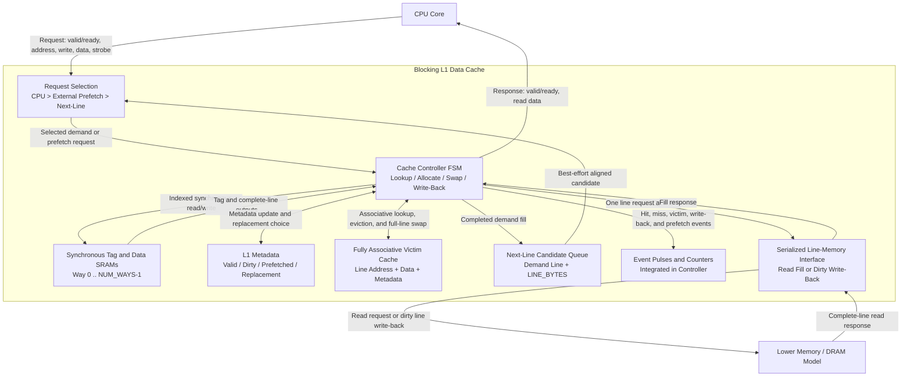

# Baseline L1 数据缓存

## 当前状态

本文档是 baseline L1 数据缓存的中文说明副本；英文
`docs/l1d_baseline.md` 是权威版本。当前 RTL 实现了 blocking、
write-back、write-allocate 数据缓存，包含：

- 可配置的直接映射或 2 路组相联结构；
- 同步 tag/data SRAM wrapper；
- CPU 与缓存行内存侧 ready/valid 接口；
- 管理脏行驱逐和缓存行分配的 FSM；
- 参数化全相联 victim cache；
- next-line prefetch，以及基础的有效性和污染计数器；
- Icarus Verilog 自检测试和 Vivado batch 入口。

Icarus Verilog 仅用于快速初步功能检查。项目最终以 Vivado 仿真和综合
结果为准。

## 源码结构

| 路径 | 用途 |
| --- | --- |
| `src/l1d_sram.sv` | 单端口同步 SRAM 推断 wrapper |
| `src/l1d_next_line_prefetch.sv` | 可替换的单 entry next-line candidate generator |
| `src/l1d_cache.sv` | 缓存 datapath、FSM、victim cache、prefetcher 和计数器 |
| `src/tb_l1d_cache.sv` | 自检 testbench 和缓存行内存模型 |
| `scripts/run_iverilog.sh` | 功能与 synthetic workload 初步回归 |
| `scripts/summarize_workloads.sh` | 将 workload 日志记录转换为 CSV |
| `scripts/run_vivado.tcl` | Vivado 仿真、综合、资源、时序与功耗报告 |
| `constraints/l1d_baseline.xdc` | 默认 100 MHz 综合时钟约束 |
| `traces/smoke.trace` | 可重新分发的 trace replay 格式 smoke test |

所有 SystemVerilog 文件均位于 `src/` 下。

## 架构与 Block Diagram 审查

组员绘制的原图包含了正确的高层组件，但若要准确描述当前 RTL，需要做以下
修正：

- CPU request 和 response 分别使用独立的 ready/valid handshake；
  `cpu_req_ready` 属于 request channel，而 `cpu_rsp_valid` 和
  `cpu_rsp_ready` 属于 response channel；
- hit/miss 由 tag、valid metadata 和全相联 victim lookup 决定，不是由
  data array 决定；
- next-line 地址是 `line_address + LINE_BYTES`，不是 byte address `+1`；
  prefetcher 只产生 candidate，不直接访问内存；
- victim entry 保存完整 line address、line data、valid、dirty 和
  prefetched metadata；victim hit 会同时交换数据与 metadata；
- dirty victim replacement 通过 controller write-back state 发送，不是
  victim cache 直接访问内存；
- event counter 当前集成在 `l1d_cache` 内，不是独立 hardware monitor
  module；
- 当前 blocking 设计只有一条串行下级内存请求路径，因此图中的 bus
  arbiter 实际是 FSM request selection，而非独立 multi-master
  interconnect。

修正后的 implementation-level diagram 如下。为避免 Mermaid 中文渲染问题，
图中统一使用英文：



`SELECT`、`META`、`MON` 和 `MEMIF` 是 `l1d_cache.sv` 内部的概念边界；
当前 baseline 中只有 SRAM wrapper 和 next-line generator 是独立 RTL
module instance。

## 参数

| 参数 | 默认值 | 约束或含义 |
| --- | ---: | --- |
| `ADDR_WIDTH` | 32 | 字节地址宽度 |
| `DATA_WIDTH` | 32 | CPU 传输宽度，支持字节写使能 |
| `LINE_BYTES` | 16 | 2 的幂次的缓存行大小 |
| `NUM_SETS` | 8 | 至少为 2 的 2 次幂 |
| `NUM_WAYS` | 2 | `1` 表示直接映射，`2` 表示 2 路 |
| `VICTIM_ENTRIES` | 4 | 非零的 2 次幂，目标范围为 4 至 8 |
| `ENABLE_PREFETCH` | 1 | 允许在空闲周期发起 next-line prefetch |

当前每个 set 使用 round-robin 替换，并优先选择 invalid way。

## 接口约定

### CPU 请求与响应

上升沿满足 `cpu_req_valid && cpu_req_ready` 时接收请求。请求包含字节
地址、读写类型、写数据和逐字节写使能。缓存是 blocking 结构，同一时间
只处理一个请求。

`cpu_rsp_valid` 会保持到 `cpu_rsp_ready` 接收响应。load 在
`cpu_rsp_rdata` 返回选中的 word；store 也会产生完成响应，返回值是写后
word，调用方可以忽略。

CPU 地址必须按 `DATA_WIDTH/8` 对齐；跨 word 或 cache line 的访问不属于
本 baseline，并会触发仿真 assertion。

### 下级缓存行内存接口

下级接口按完整缓存行传输。读请求使用对齐地址，之后由
`mem_rsp_valid` 返回缓存行。write-back 使用 `mem_req_write=1` 和
`mem_req_wdata`。当前 baseline 假设写请求被 `mem_req_ready` 接收后即
完成，没有单独的写响应和错误通道。

## FSM 与数据流

主要状态如下：

1. `ST_IDLE`：接收 CPU 请求；若 CPU 无请求，则启动等待中的 prefetch。
2. `ST_LOOKUP`：使用同步 SRAM 输出比较所有 L1 way 和 victim entry。
3. `ST_HIT_WRITE`：提交带字节使能的 store hit。
4. `ST_VC_SWAP`：将 victim hit 的行提升到 L1，并把选中的 L1 行放入同一
   victim entry。
5. `ST_WB_REQ`：写回即将被替换的脏 victim 行。
6. `ST_VC_INSERT`：将 L1 驱逐行放入 victim cache。
7. `ST_MEM_READ_REQ` / `ST_MEM_READ_WAIT`：请求并等待缓存行填充。
8. `ST_INSTALL`：安装 demand 或 prefetch 缓存行。
9. `ST_RESP`：保持 CPU 响应直到被接收。

同步 SRAM 读在 `ST_IDLE` 发起，在 `ST_LOOKUP` 使用 tag/data 输出。
valid、dirty 和 prefetched metadata 由独立寄存器保存。

## Write-Back / Write-Allocate

- store hit 只更新写使能覆盖的字节，并将 L1 行标记为 dirty；
- store miss 先读取完整缓存行，再合并写数据并以 dirty 状态安装；
- L1 替换首先把缓存行移动到 victim cache；
- 若目标 victim entry 中已有 dirty 行，先将其写回下级内存；
- victim hit 直接交换 victim 与 L1 的数据和 metadata，不立即写回脏行。

这种延迟 write-back 行为是 baseline 中降低 conflict miss 代价并保证脏
数据不丢失的核心机制。

## Victim Cache

Victim cache 是全相联结构，并行比较对齐后的缓存行地址。每个 entry 保存
valid、dirty、prefetched、地址和完整缓存行数据，采用 round-robin 替换。

Demand victim hit 时：

1. victim 行进入选中的 L1 way；
2. 有效的 L1 被替换行进入命中的 victim slot；
3. 若 L1 选择的是 invalid way，则 victim slot 失效；
4. CPU 操作作用于提升后的缓存行。

Testbench 对直接映射和 2 路配置都验证了 victim rescue，并验证 dirty 行
在 victim cache 继续承受替换压力后最终正确写入 backing memory。

## Next-Line Prefetch 与监控

Demand fill 完成后，缓存排队请求下一条对齐缓存行。Prefetch 只在
`ST_IDLE` 且 CPU 没有请求时运行，因此 demand 优先。若目标行已存在于 L1
或 victim cache，则不会重复读取。

监控计数器包括：

| 计数器 | 含义 |
| --- | --- |
| `stat_prefetch_fills` | 安装到 L1 的 prefetch 行 |
| `stat_prefetch_useful` | 之后被 CPU 使用的 prefetch 行 |
| `stat_prefetch_useless` | 未被 CPU 使用且最终在 victim cache 中被覆盖的 prefetch 行 |
| `stat_prefetch_pollution` | 导致 demand L1 行被移出的 prefetch 分配 |
| `stat_prefetch_dropped` | built-in 单 entry 队列已满时丢弃的 candidate |

`stat_prefetch_pollution` 是缓存压力的硬件 proxy，不等同于性能一定下降，
因为被移出的行可能仍由 victim cache 救回。最终分析必须结合 miss、
内存流量和 AMAT。

### Adaptation 接口

`cfg_prefetch_enable` 是运行时 master switch，
`cfg_next_line_enable` 只控制 built-in next-line generator。
关闭 built-in generator 会清除 pending candidate，重新启用后不会发出旧
workload phase 中学习到的地址。外部策略可通过
`ext_prefetch_valid`、`ext_prefetch_ready` 和 `ext_prefetch_addr` 注入
candidate，缓存会把被接收的地址对齐到缓存行。

单周期 event 输出报告 CPU access/hit/miss、victim hit、write-back，以及
prefetch fill/useful/useless/pollution/drop，供后续 adaptive controller 和
verification monitor 使用。累计计数器继续用于软件可见或仿真结束统计。

研究依据和 direct L1 prefetch insertion 的限制见
`docs/literature_review.md`。

## Icarus 初步验证

运行：

```bash
./scripts/run_iverilog.sh
```

脚本包含定向测试、内存接口 backpressure、CPU response backpressure、
握手 payload 稳定性检查、160 次操作的 deterministic randomized
golden-memory scoreboard，以及三种 synthetic workload 配置。
2026 年 6 月 10 日的结果：

| 配置 | 覆盖内容 | 结果 |
| --- | --- | --- |
| 直接映射，VC4，关闭 prefetch | hit/miss、write-allocate、字节写、victim hit、dirty preservation、随机流量 | PASS |
| 2 路，VC4，关闭 prefetch | 同上，并覆盖 way replacement 和 backpressure | PASS |
| 2 路，VC8，关闭 prefetch | 8-entry victim replacement 和 dirty preservation | PASS |
| 2 路，VC4，开启 prefetch | next-line fill、prefetch victim rescue、外部注入和 usefulness 计数 | PASS |
| Direct-mapped，VC4，关闭 prefetch | 五种 synthetic boundary profile | PASS |
| 2 路，VC4，关闭 prefetch | 五种 synthetic boundary profile | PASS |
| 2 路，VC4，开启 prefetch | 五种 synthetic boundary profile 和 prefetch boundary assertion | PASS |
| 2 路，VC4，关闭 prefetch | 文本 trace replay、写、byte strobe 和 golden-memory 检查 | PASS |

生成的 `.vvp` 和日志位于 `sim/`。Icarus 会输出关于 `always_*` constant
select 的提示信息，但编译和全部自检均成功。

每个 workload 都会输出一行机器可读的 `WORKLOAD_RESULT`。
`scripts/summarize_workloads.sh` 将这些记录汇总到被忽略的
`sim/workload_results.csv`。记录字段包括 access、hit、miss、victim hit、
被下级内存接受的读写请求、prefetch 事件和 testbench cycle。

## Vivado 验证

2026 年 6 月 10 日已使用 Vivado 2024.2.1 对
`xc7a35tcpg236-1` 成功执行 batch flow。本地 macOS 仍使用 Icarus
进行初步回归，最终 XSim 和综合在远端 Windows Vivado 上完成。七种 XSim
配置均输出 `ALL TESTS PASSED`：

| XSim 配置 | 结果 |
| --- | --- |
| 直接映射，VC4，关闭 prefetch | PASS |
| 2 路，VC4，关闭 prefetch | PASS |
| 2 路，VC8，关闭 prefetch | PASS |
| 2 路，VC4，开启 next-line prefetch | PASS |
| 直接映射，VC4，synthetic workload | PASS |
| 2 路，VC4，synthetic workload | PASS |
| 2 路，VC4，prefetch synthetic workload | PASS |

在 Vivado 已加入 `PATH` 的机器上，可用以下命令重复该流程：

```tcl
vivado -mode batch -source scripts/run_vivado.tcl
```

脚本默认目标器件为 `xc7a35tcpg236-1`，可用环境变量 `L1D_PART` 覆盖。
脚本运行四种功能仿真和三种 synthetic workload 仿真，然后使用 10 ns
时钟约束综合四种硬件配置，在
`build/vivado/reports/<configuration>/` 生成：

- `utilization.rpt`；
- `timing_summary.rpt`；
- `power.rpt`。

仿真日志复制到 `build/vivado/reports/`。6 月 10 日的综合结果如下：

| 配置 | LUT | FF | RAMB36 | 10 ns 下 WNS | 综合后近似 Fmax | Vectorless power |
| --- | ---: | ---: | ---: | ---: | ---: | ---: |
| 直接映射，VC4，关闭 prefetch | 1,502 | 1,493 | 2 | 1.876 ns | 123.1 MHz | 0.100 W |
| 2 路，VC4，关闭 prefetch | 1,839 | 1,621 | 4 | 1.525 ns | 118.0 MHz | 0.099 W |
| 2 路，VC8，关闭 prefetch | 2,081 | 2,262 | 4 | 1.366 ns | 115.8 MHz | 0.103 W |
| 2 路，VC4，开启 prefetch | 1,900 | 1,750 | 4 | 2.112 ns | 126.8 MHz | 0.104 W |

四种配置均满足 100 MHz 综合约束。data array 被推断为 block RAM，tag
array 被推断为 distributed RAM。Fmax 按 `1000 / (10 - WNS)` 计算，只是
综合后 STA 估算；布局布线后结果可能下降。

功耗值使用 Vivado vectorless activity propagation，没有 SAIF/VCD activity
文件，采用默认 operating condition，且置信度为 `Low`。这些数据只能作为
早期相对估算。顶层 I/O 数量也很高，因此不能把它们视为板级功耗预测。

Windows 上应使用纯 ASCII 工程路径。Vivado 仿真可以在中文用户目录下运行，
但综合子进程无法重新打开包含非 ASCII 字符的工程路径。

最终签核前仍需检查所有 FSM 路径的 XSim 波形，并执行 implementation/
post-route timing。为了获得有意义的功耗比较，还应使用 workload trace
产生的代表性 switching activity 重新运行 `report_power`。

## Workload-Driven Boundary Analysis

### Benchmark 基础

SPEC CPU 2017 用作兼容性和历史对比 baseline。2026 年 5 月 5 日发布的
SPEC CPU 2026 是当前主要目标。SPEC 官方页面分别说明 CPU 2017 包含 43
个 benchmark，CPU 2026 包含 52 个 benchmark，并都分为整数/浮点和
speed/rate 套件。

来源：

- [SPEC CPU 2017](https://www.spec.org/cpu2017/)
- [SPEC CPU 2026](https://www.spec.org/cpu2026/)

两套 benchmark 都受许可证约束。符合条件的认证高校可由教授或全职员工
申请免费的 SPEC CPU 2026 学术许可证。不得把 benchmark 源码或专有输入
数据提交到本仓库。

当前本地状态：没有下载 SPEC CPU benchmark package。本 workspace 中没有
已授权的本地副本，也没有公开免登录下载 URL；目前只记录公开文档链接。

### 基于 Trace 的 RTL 方法

在 RTL testbench 中直接运行完整 SPEC 程序并不现实。计划采用：

1. 在 host 或体系结构 simulator 中构建并运行获得许可的 SPEC workload；
2. 捕获已提交 load/store 的地址、大小、允许记录的写数据，以及指令计数
   或时间戳；
3. 对地址进行匿名化，同时保留 set/index/offset 行为；
4. 将有限的代表性区间通过 CPU 接口回放；
5. 分别开关 victim cache 和 prefetch 比较配置；
6. 只发布派生统计和许可证允许重新分发的 trace metadata。

使用 `+TRACE=<path>` 选择可复用 replay driver。每行格式为：

```text
# 注释以 # 开始
0 ADDRESS
1 ADDRESS DATA WRITE_STROBE
```

除十进制 opcode 外，其他字段均为十六进制。`0` 表示 32 位对齐读，`1`
表示 32 位对齐写；write strobe 每个 bit 对应一个 byte。读请求会与
testbench golden memory 比较，写请求在 cache 完成后更新 golden memory。
空行和注释行会被忽略。例如：

```bash
vvp sim/two_way_vc4.vvp +TRACE=traces/smoke.trace
```

该命令需要从仓库根目录运行。使用 ASCII 相对路径可以避免 Icarus 在工作区
绝对路径包含非 ASCII 字符时的 plusarg 限制。SPEC extraction 工具需要将
committed access 转换为该 cache interface 格式，按需对齐或拆分 access，
并在许可证不允许重新分发时省略受保护的数据值。

### Workload 类型

边界分析至少包含：

- 顺序 streaming 和 dense array 区间，用于观察 next-line prefetch 收益；
- 从一个 word 到多个 cache capacity 的 fixed-stride 扫描；
- pointer-chasing 和 graph-like 区间，用于观察低 prefetch accuracy；
- 多条活跃缓存行映射到同一 set 的 conflict 区间，用于突出 victim cache；
- 包含 dirty working set 的混合 load/store 区间，用于施加延迟 write-back
  带宽压力。

### 可执行的 synthetic boundary test

在获得合法 SPEC trace 前，初步 testbench 实现五种确定性 profile：

- `sequential_stream`：每个连续 cache line 访问一次；
- `stride_two_lines`：隔一个 line 访问，使 next-line prefetch 无法使用；
- `localized_two_line_loop`：反复复用两个相邻 line；
- `same_set_conflict_thrash`：`NUM_WAYS+1` 个 line 映射到同一个 set；
- `irregular_pointer_chase`：固定且不相邻的 line address 排列。

测试会断言 counter 守恒（`hits + misses = accesses`）、预期的 next-line
useful 或 non-useful 行为、局部循环稳定命中，以及 victim cache 对完整
冲突 working set 的保留。这些是 synthetic microbenchmark，不能替代
SPEC trace。

2026 年 6 月 10 日的 2-way VC4 初步结果如下：

| Profile | Prefetch | Hits | Misses | Victim hits | Memory reads | Useful | Useless | Cycles |
| --- | ---: | ---: | ---: | ---: | ---: | ---: | ---: | ---: |
| Sequential stream | Off | 0 | 12 | 0 | 12 | 0 | 0 | 128 |
| Sequential stream | On | 6 | 6 | 0 | 12 | 6 | 0 | 129 |
| Two-line stride | Off | 0 | 12 | 0 | 12 | 0 | 0 | 133 |
| Two-line stride | On | 0 | 12 | 0 | 24 | 0 | 6 | 227 |
| Localized loop | Off | 10 | 2 | 0 | 2 | 0 | 0 | 63 |
| Localized loop | On | 11 | 1 | 0 | 2 | 1 | 0 | 63 |
| Same-set conflict | Off | 0 | 12 | 9 | 3 | 0 | 0 | 79 |
| Irregular pointer chase | Off | 0 | 12 | 0 | 12 | 0 | 0 | 133 |
| Irregular pointer chase | On | 0 | 12 | 0 | 24 | 0 | 6 | 227 |

这些结果用于展示设计边界，而不是一般性的性能结论。对于当前 blocking
实现，next-line prefetch 将一半 sequential demand access 转换为 hit，
但没有减少下级内存总读取数。对于不相邻的 stride 和 pointer profile，
它使下级读取翻倍、cycle 增加，却没有消除 demand miss。对于 2-way
配置，victim cache 能保留三个 line 的单 set working set，因此只有最初
三个 access 到达下级内存。

每个 trace 区间记录：

- CPU access、L1 hit、demand miss 和 victim hit；
- 下级内存读取和 write-back；
- useful、useless 和 pollution prefetch 事件；
- cycle、stall cycle 和实测 AMAT；
- working-set size、load/store ratio、stride histogram 和 reuse-distance
  摘要；
- 完整缓存配置及 random/trace seed。

主要边界图应扫描 associativity、victim entry 数量（最终比较 0/4/8）、
prefetch 开关、cache capacity、line size 和下级内存延迟。当前 RTL 至少
需要一个 victim entry；真正的零 entry bypass 配置属于后续工作。

## 当前限制与后续工作

- 同时只允许一个 CPU 未完成请求，没有 MSHR 或 hit-under-miss；
- 下级接口没有错误响应和独立写确认；
- 替换策略为 round-robin，而不是真正 LRU；
- prefetch 为 best-effort，在持续 demand 流量下可能饥饿；
- 32 位计数器溢出后回绕；
- coherence、atomic、fence、flush/invalidate、ECC，以及跨 word/line 的
  unaligned access 不属于本 baseline；
- XSim 行为回归与综合后报告已经完成；最终签核仍需波形检查、
  implementation/post-route timing 和基于真实 activity 的功耗分析。
